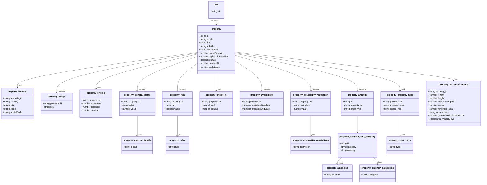

# API Template

## Description
Short summary (2-3 sentences) about what this API does and why it exists

## Metadata
Lambda Function: ...

Related Issue: ...

Status: **In Development** (Active | Deprecated | In Development)

## Working Endpoints
Use https://tabletomarkdown.com/generate-markdown-table/ to simply make your own table.

| Action | Description          | Auth Required                   | Endpoint |
| ------ | -------------------- | ------------------------------- | -------- |
| POST   | Create new resource  | Yes                             | /create  |
| GET    | Retrieve resource(s) | Depends on Endpoint             | /read    |
| PATCH  | Update resource      | Yes                             | /update  |
| DELETE | Remove resource      | Yes (author must match user_id) | /delete  |


## Security & Authorization
Add a section here how you implement security & auth

## Calculation / Logic Overview
If applicable only. Describe key logic like calculations, flows or triggers

## Class Diagram
Show your class in a Diagram. Use [Mermaid Flow](https://mermaid.live/). Github supports mermaid chart in .md

Example:



## Sequence Diagram
Use [Mermaid Live Editor](https://mermaid.live/) and its examples to make a Sequence Diagram for a POST request

Example:


## Request Examples

### POST 
```json
{
  "httpMethod": "POST",
  "headers": {
    "Authorization": "example"
  },
  "body": {
    "identifiers": {
      "property_Id": "606519ba-89a4-4e52-a940-3e4f79dabdd7"
    },
    "general": {
      "guests": 2,
      "arrivalDate": 1744934400000,
      "departureDate": 1745020800000
    }
  }
}

```
### GET
Use https://tabletomarkdown.com/generate-markdown-table/ to simply make your own table.

| `readType`  | Description                                       | Auth | Example                                                               |
| ----------- | ------------------------------------------------- | ---- | --------------------------------------------------------------------- |
| `guest`     | Fetch all bookings of a guest                     | ✅    | `/bookings?readType=guest`                                            |
| `hostId`    | Fetch all bookings for properties owned by a host | ✅    | `/bookings?readType=hostId`                                           |
| `createdAt` | Get bookings created after a certain date         | ❌    | `/bookings?readType=createdAt&property_Id=<id>&createdAt=<timestamp>` |
| `paymentId` | Get booking via Stripe payment ID                 | ✅    | `/bookings?readType=paymentId&paymentID=pi_3S5nsgGiInrsWMEc0djWC2YZ`  |

## Todo & Improvements
A general overview for things you yet have to do or improvements to add.