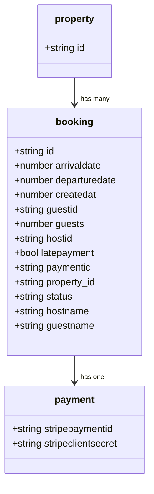
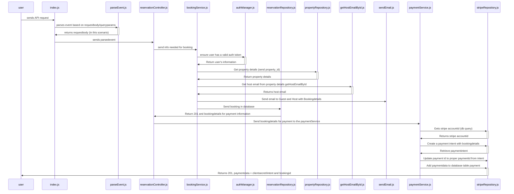

# Booking and Reservation docs

## Description
This documentation documents the CRUD operations being performed with bookings and reservations. For the guest payments, refer to the [Booking and Reservation - Guest docs](./booking_and_reservation_guest_payments.md)

## Metadata
Lambda Function: `General-Bookings-CRUD-Bookings-develop`

Related Issue: **Main issue: [#501](https://github.com/domits1/Domits/issues/501)**

Status: **In Development/Active**

## Working Endpoints
Use https://tabletomarkdown.com/generate-markdown-table/ to simply make your own table.

| Action | Description          | Auth Required                   | Endpoint |
| ------ | -------------------- | ------------------------------- | -------- |
| POST   | Create booking and payment  | Yes                             | https://92a7z9y2m5.execute-api.eu-north-1.amazonaws.com/development/bookings  |
| GET    | Retrieve bookings created at date | No             | https://92a7z9y2m5.execute-api.eu-north-1.amazonaws.com/development/bookings?readType=createdAt&property_Id=c759a4b7-8dcf-4544-a6cf-8df7edf3a7e8&createdAt=1756857600000    |
| GET    | Retrieve bookings from a departureDate | No             | https://92a7z9y2m5.execute-api.eu-north-1.amazonaws.com/development/bookings?readType=departureDate&property_Id=c759a4b7-8dcf-4544-a6cf-8df7edf3a7e8&departureDate=1749513600000    |
| GET    | Retrieve bookings from a guest's id  | Yes             | https://92a7z9y2m5.execute-api.eu-north-1.amazonaws.com/development/bookings?readType=guest    |
| GET    | Retrieve bookings from a hostId  | Yes             | https://92a7z9y2m5.execute-api.eu-north-1.amazonaws.com/development/bookings?readType=guest    |
| GET    | Retrieve bookings from a paymentId  | Yes             | https://92a7z9y2m5.execute-api.eu-north-1.amazonaws.com/development/bookings?readType=paymentId&paymentID=pi_3S5nsgGiInrsWMEc0djWC2YZ    |
| PATCH  | Update booking to set status as confirmed (checks stripe auth)      | No                             | https://92a7z9y2m5.execute-api.eu-north-1.amazonaws.com/development/bookings?paymentid=${paymentID}  |


## Security & Authorization

Authorization will use your access_token.

*How to grab your access token?*

1. Head to domits.com, acceptance.domits.com or if you're running localhost, localhost
2. Open the Dev console (CTRL+SHIFT+I)
3. Click the application tab, copy the token from **CognitoIdentityServiceProvider**.xxxxxxxxxxxxxxxx...**accessToken**
4. Copy and paste this into your request as header (If you're using Postman or any API application to invoke the request, be aware that the accessToken resets every hour.)


## Calculation / Logic Overview
There is no clear logic to be explained. The payment does have some logic/calculation which needs explanation.

## Class Diagram
Show your class in a Diagram. Use [Mermaid Flow](https://mermaid.live/). Github supports mermaid chart in .md

Example:



## Sequence Diagram
Use [Mermaid Live Editor](https://mermaid.live/) and its examples to make a Sequence Diagram for a POST request

### POST sequence diagram



## Request Examples

### POST 
Endpoint: https://92a7z9y2m5.execute-api.eu-north-1.amazonaws.com/development/bookings
```json
{
  "httpMethod": "POST",
  "headers": {
    "Authorization": "ADDYOUROWNTOKENHERE()"
  },
  "body": {
    "identifiers": {
      "property_Id": "c759a4b7-8dcf-4544-a6cf-8df7edf3a7e8"
    },
    "general": {
      "guests": 2,
      "arrivalDate": 1744934400000,
      "departureDate": 1745020800000
    }
  }
}

```
### GET

| `readType`  | Description                                       | Auth | Example                                                               |
| ----------- | ------------------------------------------------- | ---- | --------------------------------------------------------------------- |
| `guest`     | Fetch all bookings of a guest                     | ✅    | `/bookings?readType=guest`                                            |
| `hostId`    | Fetch all bookings for properties owned by a host | ✅    | `/bookings?readType=hostId`                                           |
| `createdAt` | Get bookings created after a created at date         | ❌    | `/bookings?readType=createdAt&property_Id=<id>&createdAt=<timestamp>` |
| `paymentId` | Get booking via Stripe payment ID                 | ✅    | `/bookings?readType=paymentId&paymentID=pi_3S5nsgGiInrsWMEc0djWC2YZ`  |
| `departureDate` | Get bookings from a departureDate | ❌ | `/bookings?readType=departureDate&property_Id=c759a4b7-8dcf-4544-a6cf-8df7edf3a7e8&departureDate=1749513600000` |

## Todo & Improvements
Todo:
- [ ] Add GET requests as sequence diagram
- [ ] Finish the rest of the documentation