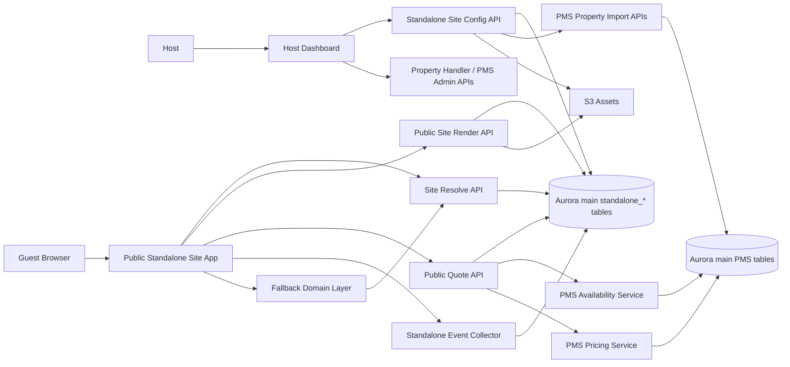
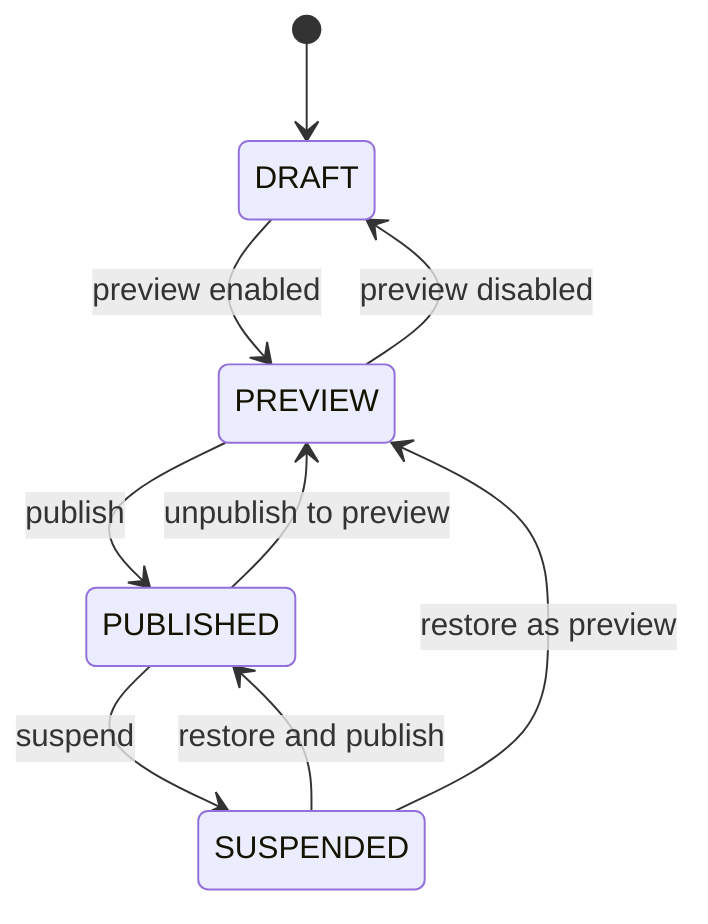
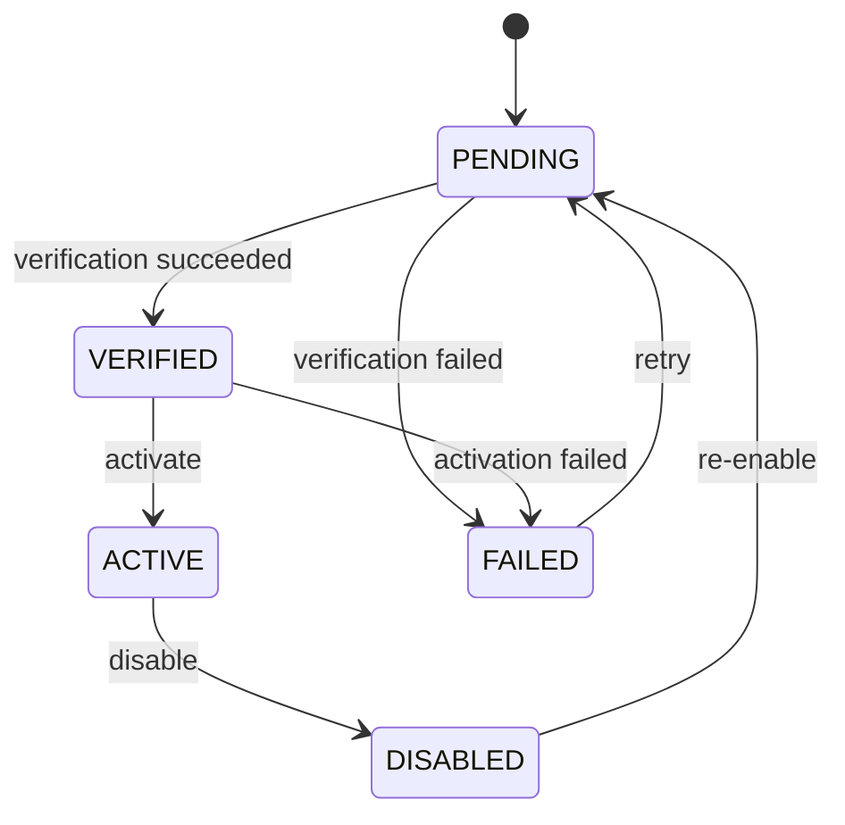
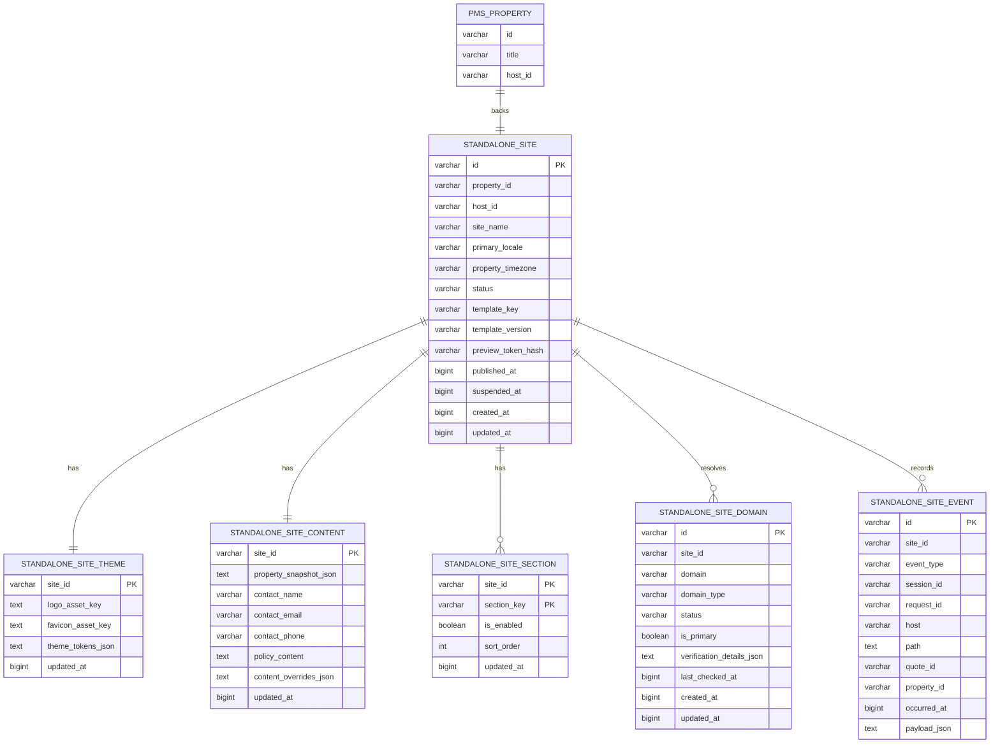
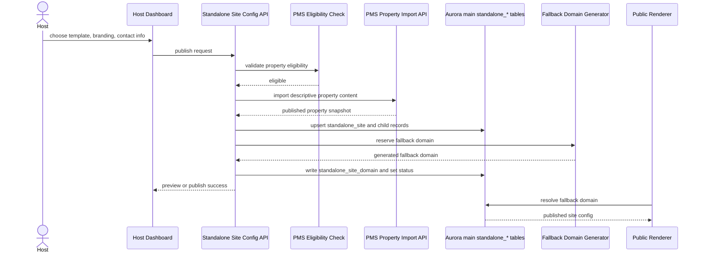
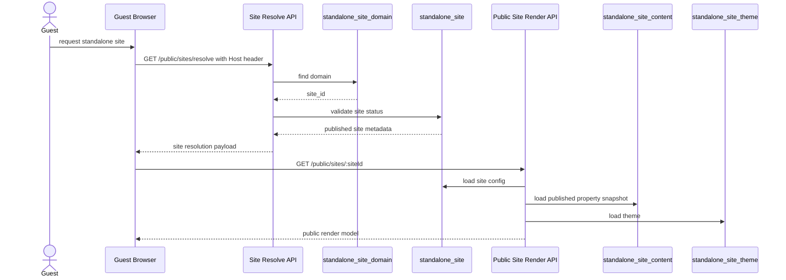
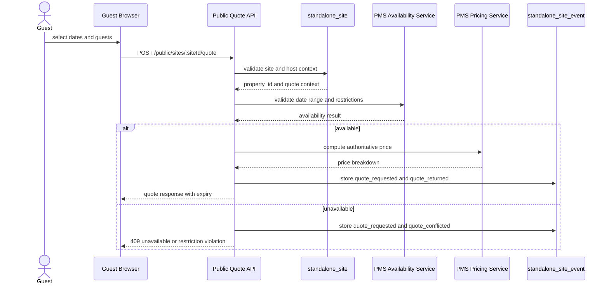
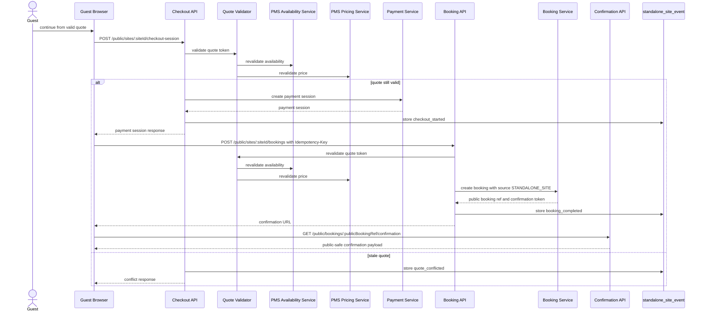

# Standalone Property Site Design Pack

## Description
This document defines the v1 design pack for Domits standalone property sites. It is intended to be implementation-ready for another engineer without leaving core policy, interface, or rollout decisions undefined.

## Metadata
**Owner:** Product / Engineering

**Status:** Proposed

**Last Updated:** 2026-03-20

**Related Architecture Decision:** [ADR - Standalone Property Site V1](./standalone_property_site_adr.md)

## Summary
V1 is the foundation release for standalone property sites. It is intentionally small so Domits can lay down a clean, secure, maintainable base for later iteration in v2.

V1 foundation includes:

- one standalone site per property
- a single multi-tenant frontend runtime
- PMS as the upstream source for descriptive property-content import
- PMS as the live source of truth for pricing, availability, and bookings
- standalone-owned site config, published content snapshots, and publish state
- fallback Domits subdomain in v1
- custom domains designed now, implemented later
- first-party analytics events for KPI reporting
- baked published page content for public render after publish
- live PMS reads only for quote pricing and availability
- a target guest flow that covers property detail, availability check, and price calculation
- an explicit language and tooling choice aligned with Domits constraints
- no payment checkout, booking creation, or public confirmation in v1

V2 extends this foundation with:

- booking funnel
- booking creation
- public confirmation
- booking-specific telemetry and rollout steps

---

## 1. V1 Scope And Exclusions

### V1 scope
V1 includes:

- Public property page rendered from a published standalone content snapshot imported from PMS:
  - title
  - subtitle
  - description
  - images
  - amenities
  - location
  - house rules
  - availability window metadata
  - timezone
- Standalone-owned site config:
  - template choice
  - site name
  - logo
  - favicon
  - brand colors / design tokens
  - enabled sections
  - contact info
  - cancellation / policy content
  - preview URL
  - fallback subdomain
  - publish / unpublish
- Server-side quote flow:
  - availability check
  - pricing quote
  - availability window validation
  - restriction validation
  - quote expiry metadata
- First-party analytics events
- Separate standalone site state model
- Separate domain state model for fallback subdomains
- Publish-time import of PMS descriptive content into standalone-owned render data
- Site language and tooling baseline:
  - English is the first and only primary site language in v1
  - broader host-selectable locale support is later scope
  - implementation aligned with the current Domits stack instead of introducing a second frontend/runtime stack

### Explicit v1 exclusions
V1 does not include:

- payment checkout
- booking creation
- public booking confirmation flow
- multi-property websites
- visual page builder
- arbitrary CSS injection
- full multilingual SEO platform
- public host chat
- custom domain implementation

### Delivery sequencing
Delivery is staged so v1 stays foundation-first:

- V1 foundation:
  - property detail page
  - preview and publish flow
  - fallback domain
  - server-side availability and quote
  - analytics and observability baseline
- V2 extension:
  - checkout session
  - booking creation
  - booking confirmation
  - booking source attribution
  - quote revalidation and idempotency enforcement
- Later phase beyond v2:
  - custom domains
  - advanced multilingual support
  - multi-property websites
  - visual builder capabilities

---

## 2. System Context Diagram



### Context notes
- The standalone layer owns site configuration, published render data, and events.
- PMS remains the upstream source for descriptive property import and the live source of truth for pricing, availability, and bookings.
- Public render uses standalone-owned published content snapshots and assets, not live PMS descriptive reads.
- Public guest traffic never talks directly to raw PMS tables.
- This diagram shows the v1 foundation only.
- V2 adds checkout, payment, booking creation, and confirmation on top of this base.

### Tooling and language baseline
- Frontend runtime stays inside the existing Domits React stack; templates do not become separate frontend projects.
- Public site APIs stay aligned with the current AWS backend model: Lambda / API Gateway plus Aurora `main`.
- Standalone assets remain in S3 and site telemetry remains first-party in `main.standalone_site_event`.
- V1 uses English as the only supported primary site language. Full multilingual SEO, translation management, and host-selectable locales are later concerns.

---

## 3. State Model

### `standalone_site.status`

| State | Meaning | Public Access |
|------|------|------|
| `DRAFT` | Site config exists but is not previewable yet | No |
| `PREVIEW` | Site can be viewed only with a preview token | Private only |
| `PUBLISHED` | Site is publicly available on the fallback subdomain | Yes |
| `SUSPENDED` | Site is intentionally disabled due to policy, integrity, or dependency issues | No |

### Site state rules
- Site status is independent from PMS property `ACTIVE`, `INACTIVE`, and `ARCHIVED`.
- Publishing requires a PMS eligibility check.
- PMS ineligibility after publish does not silently mutate standalone records; it changes public behavior according to the failure-mode table.
- Preview never enables later booking flows by default.



### `standalone_site_domain.status`

| State | Meaning |
|------|------|
| `PENDING` | Domain record exists but is not yet ready |
| `VERIFIED` | Domain is validated and ready for activation |
| `ACTIVE` | Domain is actively serving traffic |
| `FAILED` | Verification or activation failed |
| `DISABLED` | Domain was intentionally turned off |

### Domain state rules
- V1 fallback domains follow an internal activation path and do not require user DNS work.
- Custom domains use the same state model later, but custom-domain implementation is out of scope for v1.



### Optional later `quote.status`
Future only:

- `OPEN`
- `EXPIRED`
- `SUPERSEDED`
- `CONFLICTED`

---

## 4. Ownership Matrix

| PMS-owned | Standalone-owned |
|------|------|
| property identity | site identity |
| descriptive-content source records | published property snapshot |
| pricing rules | template selection |
| availability rules | template version pin |
| bookings | branding and theme tokens |
| | enabled sections |
| | site name |
| | preview token metadata |
| | publish status |
| | fallback domain mapping |
| | future custom-domain metadata |
| | analytics event metadata |
| | quote-facing timezone snapshot |
| | content overrides |
| | public contact info |
| | policy content |
| | primary locale |

### Ownership policy
- PMS-owned descriptive content is imported into standalone-owned published snapshots at publish time or explicit refresh time.
- Public render reads standalone-owned published data and assets.
- PMS remains the live source of truth for quote pricing and availability.
- PMS changes to title, photos, or description do not affect the public site until the host republishes or refreshes the snapshot.

---

## 5. Data Model

### Table overview

| Table | Purpose |
|------|------|
| `main.standalone_site` | core site record, property linkage, quote-facing timezone, and lifecycle |
| `main.standalone_site_theme` | one-to-one branding tokens and asset keys |
| `main.standalone_site_content` | one-to-one published property snapshot, overrides, and contact info |
| `main.standalone_site_section` | enabled sections and ordering |
| `main.standalone_site_domain` | fallback and future custom-domain mapping |
| `main.standalone_site_event` | raw event store for KPI and auditability |

### Proposed schema

```sql
CREATE TABLE IF NOT EXISTS main.standalone_site (
  id VARCHAR(255) NOT NULL,
  property_id VARCHAR(255) NOT NULL,
  host_id VARCHAR(255) NOT NULL,
  site_name VARCHAR(255) NOT NULL,
  primary_locale VARCHAR(32) NOT NULL,
  property_timezone VARCHAR(64) NOT NULL,
  status VARCHAR(32) NOT NULL,
  template_key VARCHAR(255) NOT NULL,
  template_version VARCHAR(64) NOT NULL,
  preview_token_hash VARCHAR(255),
  published_at BIGINT,
  suspended_at BIGINT,
  created_at BIGINT NOT NULL,
  updated_at BIGINT NOT NULL,
  PRIMARY KEY (id)
);
CREATE UNIQUE INDEX ASYNC standalone_site_property_unique
  ON main.standalone_site (property_id);
CREATE INDEX ASYNC standalone_site_host_idx
  ON main.standalone_site (host_id);
CREATE INDEX ASYNC standalone_site_status_idx
  ON main.standalone_site (status);

CREATE TABLE IF NOT EXISTS main.standalone_site_theme (
  site_id VARCHAR(255) NOT NULL,
  logo_asset_key TEXT,
  favicon_asset_key TEXT,
  theme_tokens_json TEXT NOT NULL,
  updated_at BIGINT NOT NULL,
  PRIMARY KEY (site_id)
);

CREATE TABLE IF NOT EXISTS main.standalone_site_content (
  site_id VARCHAR(255) NOT NULL,
  property_snapshot_json TEXT NOT NULL,
  contact_name VARCHAR(255),
  contact_email VARCHAR(255),
  contact_phone VARCHAR(255),
  policy_content TEXT,
  content_overrides_json TEXT NOT NULL,
  updated_at BIGINT NOT NULL,
  PRIMARY KEY (site_id)
);

CREATE TABLE IF NOT EXISTS main.standalone_site_section (
  site_id VARCHAR(255) NOT NULL,
  section_key VARCHAR(255) NOT NULL,
  is_enabled BOOLEAN NOT NULL,
  sort_order INTEGER NOT NULL,
  updated_at BIGINT NOT NULL,
  PRIMARY KEY (site_id, section_key)
);
CREATE INDEX ASYNC standalone_site_section_sort_idx
  ON main.standalone_site_section (site_id, sort_order);

CREATE TABLE IF NOT EXISTS main.standalone_site_domain (
  id VARCHAR(255) NOT NULL,
  site_id VARCHAR(255) NOT NULL,
  domain VARCHAR(255) NOT NULL,
  domain_type VARCHAR(32) NOT NULL,
  status VARCHAR(32) NOT NULL,
  is_primary BOOLEAN NOT NULL,
  verification_details_json TEXT NOT NULL,
  last_checked_at BIGINT,
  created_at BIGINT NOT NULL,
  updated_at BIGINT NOT NULL,
  PRIMARY KEY (id)
);
CREATE UNIQUE INDEX ASYNC standalone_site_domain_unique
  ON main.standalone_site_domain (domain);
CREATE INDEX ASYNC standalone_site_domain_site_idx
  ON main.standalone_site_domain (site_id);
CREATE INDEX ASYNC standalone_site_domain_status_idx
  ON main.standalone_site_domain (status);

CREATE TABLE IF NOT EXISTS main.standalone_site_event (
  id VARCHAR(255) NOT NULL,
  site_id VARCHAR(255) NOT NULL,
  event_type VARCHAR(255) NOT NULL,
  session_id VARCHAR(255),
  request_id VARCHAR(255),
  host VARCHAR(255),
  path TEXT,
  quote_id VARCHAR(255),
  property_id VARCHAR(255),
  occurred_at BIGINT NOT NULL,
  payload_json TEXT NOT NULL,
  PRIMARY KEY (id)
);
CREATE INDEX ASYNC standalone_site_event_site_idx
  ON main.standalone_site_event (site_id);
CREATE INDEX ASYNC standalone_site_event_occurred_idx
  ON main.standalone_site_event (occurred_at);
CREATE INDEX ASYNC standalone_site_event_type_idx
  ON main.standalone_site_event (event_type);
```

### Data model policy
- `property_id` is unique in `main.standalone_site`; one site per property in v1.
- `preview_token_hash` stores only a hash, never the raw preview token.
- JSON fields are stored as validated JSON strings in `TEXT` columns to stay aligned with current Domits patterns.
- All standalone reads and writes must explicitly target `main`.

### Fallback domain generation
V1 fallback domains use this format:

`{site-slug}-{site-id-short}.stay.domits.com`

Rules:
- `site-slug` is generated from `site_name`
- `site-id-short` is a stable short suffix from the site ID
- fallback domain is stored in `main.standalone_site_domain`
- fallback domain does not auto-change when `site_name` changes

### ERD



---

## 6. Template Contract

### Required template contract

| Contract area | Requirement |
|------|------|
| Data source | Must render standalone-owned published property content snapshots |
| Theme source | Must read standalone theme tokens |
| Sections | Must support section enable/disable and ordering |
| CTA contract | Must expose a consistent availability and quote CTA |
| Route contract | Must support property page and preview route in v1 |
| Language support | Must render English as the only supported primary site language in v1 and keep template copy localizable for later locales |
| Accessibility | Must support keyboard navigation, semantic headings, contrast-safe tokens |
| Analytics | Must emit shared standalone event names |
| Failure handling | Must render suspended / unavailable / quote-conflict states safely |
| Domain independence | Must not hardcode a single host or asset base URL |

### Required sections

| Section key | Required |
|------|------|
| `hero` | Yes |
| `gallery` | Yes |
| `amenities` | Yes |
| `location` | Yes |
| `house_rules` | Yes |
| `availability_quote` | Yes |
| `contact` | Yes |
| `policy` | Yes |

### Optional sections

| Section key | Required |
|------|------|
| `intro_highlights` | No |
| `nearby` | No |
| `faq` | No |

### Required design tokens

| Token | Purpose |
|------|------|
| `brand.primary` | primary buttons and accents |
| `brand.secondary` | secondary accents |
| `surface.background` | page background |
| `surface.card` | card background |
| `text.primary` | main body text |
| `text.muted` | secondary text |
| `border.default` | default borders |
| `radius.card` | card radius |
| `font.heading` | heading font family |
| `font.body` | body font family |

---

## 7. Content Mapping Table

| Source field | Owner | Standalone section | Notes |
|------|------|------|------|
| `property.title` | Standalone published snapshot | `hero` | imported from PMS at publish/refresh time |
| `property.subtitle` | Standalone published snapshot | `hero` | imported from PMS at publish/refresh time |
| `property.description` | Standalone published snapshot | `hero` / `about` | imported from PMS at publish/refresh time |
| `images[]` | Standalone published snapshot | `gallery` | imported from PMS at publish/refresh time |
| `amenities[]` | Standalone published snapshot | `amenities` | imported from PMS at publish/refresh time |
| `location.city` / `location.country` | Standalone published snapshot | `location` | full address remains hidden unless policy allows |
| `rules[]` | Standalone published snapshot | `house_rules` | imported from PMS at publish/refresh time |
| `availability window` | Standalone published snapshot | `availability_quote` | display snapshot only |
| `timezone` | Standalone quote context | `availability_quote` | stored with the site; quote behavior still validates live |
| `primary_locale` | Standalone | global | fixed to English (`en`) in v1; broader locale choice is later |
| `contact_name` | Standalone | `contact` | public override |
| `contact_email` | Standalone | `contact` | public override |
| `contact_phone` | Standalone | `contact` | public override |
| `policy_content` | Standalone | `policy` | public override |
| `theme_tokens_json` | Standalone | all sections | runtime theme |

---

## 8. Public API Contract

### Common response rules
- Money is returned in minor units as integers.
- Dates are ISO date strings in the property timezone context.
- Every error body includes `code`, `message`, and `requestId`.
- Public APIs never accept `propertyId` from the guest client as authoritative input.

### Common error body

```json
{
  "error": {
    "code": "site_not_found",
    "message": "No published site was found for the requested host.",
    "requestId": "req_01JQ7J4G7D5VY2WJ8F7Q7M4R9A"
  }
}
```

### Preview access model
Preview URL format:

`https://preview.stay.domits.com/sites/{siteId}?previewToken={opaque-token}`

Rules:
- preview URLs are private
- preview token is stored only as a hash
- preview mode is separate from host-based resolution
- preview mode never implies later booking permission

### `GET /public/sites/resolve`

**Purpose:** resolve incoming host to a published standalone site

**Input**
- `Host` header from the request
- optional `host` query parameter for internal testing only

**Success response**

```json
{
  "siteId": "site_01JQ7HTH5M0H8VW4M7B0W4G8E1",
  "propertyId": "0a1f14bb-8dd9-45a9-aeb0-9ad9b609741e",
  "status": "PUBLISHED",
  "templateKey": "editorial-split",
  "templateVersion": "1.0.0",
  "primaryDomain": "santorini-cliff-4f2a6c9e.stay.domits.com",
  "primaryLocale": "nl-NL",
  "timezone": "Europe/Athens"
}
```

**Errors**
- `404 site_not_found`
- `409 site_not_published`
- `410 site_suspended`

### `GET /public/sites/:siteId`

**Purpose:** return the public render model for a published site

**Rules**
- validates the request host against the resolved site
- reads site config from standalone tables
- reads published property content snapshot from standalone tables
- resolves public asset references from standalone-owned storage
- returns only public-safe data

**Success response**

```json
{
  "site": {
    "siteId": "site_01JQ7HTH5M0H8VW4M7B0W4G8E1",
    "siteName": "Santorini Cliff House",
    "status": "PUBLISHED",
    "templateKey": "editorial-split",
    "templateVersion": "1.0.0",
    "primaryDomain": "santorini-cliff-4f2a6c9e.stay.domits.com",
    "primaryLocale": "nl-NL"
  },
  "theme": {
    "logoAssetKey": "standalone/site_01/logo.svg",
    "faviconAssetKey": "standalone/site_01/favicon.ico",
    "tokens": {
      "brand.primary": "#4F7C2B",
      "brand.secondary": "#D7E8B5",
      "surface.background": "#F9FBF4",
      "font.heading": "Kanit",
      "font.body": "system-ui"
    }
  },
  "sections": [
    { "key": "hero", "enabled": true, "sortOrder": 10 },
    { "key": "gallery", "enabled": true, "sortOrder": 20 },
    { "key": "amenities", "enabled": true, "sortOrder": 30 },
    { "key": "location", "enabled": true, "sortOrder": 40 },
    { "key": "house_rules", "enabled": true, "sortOrder": 50 },
    { "key": "availability_quote", "enabled": true, "sortOrder": 60 },
    { "key": "contact", "enabled": true, "sortOrder": 70 },
    { "key": "policy", "enabled": true, "sortOrder": 80 }
  ],
  "property": {
    "propertyId": "0a1f14bb-8dd9-45a9-aeb0-9ad9b609741e",
    "title": "Santorini Cliff House",
    "subtitle": "Sea-facing villa for 4 guests",
    "description": "A calm cliffside stay with direct sunset views.",
    "images": [
      { "url": "https://cdn.domits.com/property/1/hero.jpg", "alt": "Front terrace" }
    ],
    "amenities": [
      { "id": "wifi", "label": "Wifi" },
      { "id": "kitchen", "label": "Kitchen" }
    ],
    "location": {
      "city": "Oia",
      "country": "Greece"
    },
    "houseRules": [
      { "key": "smoking", "label": "No smoking" }
    ],
    "availabilityWindow": {
      "bookableFrom": "2026-03-17",
      "bookableUntil": "2027-03-17",
      "minimumStay": 2,
      "maximumStay": 14
    },
    "timezone": "Europe/Athens"
  },
  "contact": {
    "name": "Santorini Cliff House Team",
    "email": "hello@santorini-cliff-house.example",
    "phone": "+30-210-555-0101"
  },
  "policy": {
    "content": "Free cancellation up to 7 days before check-in."
  }
}
```

### `GET /public/preview/sites/:siteId`

**Purpose:** return the preview render model for a non-published site

**Input**
- `previewToken` query parameter

**Rules**
- only valid for `PREVIEW`
- bypasses host-based public resolution
- response payload shape matches `GET /public/sites/:siteId`

**Errors**
- `401 preview_token_invalid`
- `404 site_not_found`
- `409 site_not_in_preview`

### `POST /public/sites/:siteId/quote`

**Purpose:** compute an authoritative server-side quote

**Request**

```json
{
  "checkIn": "2026-07-10",
  "checkOut": "2026-07-14",
  "guests": 2,
  "currency": "EUR",
  "session": {
    "sessionId": "ses_01JQ7K5XRT2K9S9GJCM4VYVPK4",
    "source": "standalone_site"
  }
}
```

**Success response**

```json
{
  "quoteId": "quote_01JQ7K9P4TNN0CRQZJX1P8D13H",
  "siteId": "site_01JQ7HTH5M0H8VW4M7B0W4G8E1",
  "propertyId": "0a1f14bb-8dd9-45a9-aeb0-9ad9b609741e",
  "timezone": "Europe/Athens",
  "checkIn": "2026-07-10",
  "checkOut": "2026-07-14",
  "nights": 4,
  "guestCount": 2,
  "availability": {
    "isAvailable": true,
    "bookableFrom": "2026-03-17",
    "bookableUntil": "2027-03-17",
    "minimumStay": 2,
    "maximumStay": 14
  },
  "priceBreakdown": {
    "currency": "EUR",
    "nightlyBaseTotal": 76000,
    "cleaningFee": 5000,
    "discounts": [],
    "taxes": [],
    "fees": [],
    "total": 81000
  },
  "policiesApplied": [
    "availability_window",
    "minimum_stay"
  ],
  "expiresAt": "2026-03-17T14:20:00.000Z",
  "quoteToken": "qtok_opaque_signed_value"
}
```

**Errors**
- `400 invalid_date_range`
- `400 invalid_guest_count`
- `409 unavailable_dates`
- `409 stay_restriction_violation`
- `422 quote_unavailable`
- `503 pricing_service_unavailable`

### V2 extension API outline

Booking and confirmation are intentionally moved to v2 so v1 can stay a clean foundation.

| Method | Endpoint | Purpose | V2 notes |
|------|------|------|------|
| `POST` | `/public/sites/:siteId/checkout-session` | start checkout from a valid quote | requires quote revalidation and payment dependency |
| `POST` | `/public/sites/:siteId/bookings` | create authoritative booking | requires idempotency key and booking source attribution |
| `GET` | `/public/bookings/:publicBookingRef/confirmation` | return public-safe confirmation payload | requires confirmation token |

### Auth model
Public guest endpoints are unauthenticated, but protected by:

- tenant resolution by host
- strict input validation
- rate limiting
- no trust in client-provided `propertyId`
- optional preview token for preview-only access

### Idempotency
Quote endpoint:
- does not require a client idempotency key
- must log `requestId` and `quoteId`
- may deduplicate event ingestion by `requestId`

V2 booking endpoints:
- checkout must reuse the latest valid quote and reject stale quotes
- booking must require `Idempotency-Key`
- booking must revalidate quote and availability before booking creation
- booking must attribute booking source as `STANDALONE_SITE`
- confirmation must require a public-safe confirmation token

---

## 9. Sequence Diagrams

### Publish site



### Resolve host -> site -> render



### Quote request



### V2 extension: checkout / booking / confirmation



---

## 10. Security, Risk, And Failure Handling

### Risk and threat matrix

| Risk / threat | Cause | Impact | Mitigation | Detection |
|------|------|------|------|------|
| stale published content | PMS descriptive content changes after publish | site shows outdated title, photos, or description | snapshot refresh and republish workflow | snapshot-age monitoring |
| stale quote | dates or prices change after quote | guest sees invalid price | short quote expiry, later revalidation before booking | quote conflict rate |
| domain misconfiguration | bad domain record | wrong or missing site resolution | unique domain index, status validation, fallback domain retained | resolve failure logs |
| tenant data leak | host resolution bug | one site sees another tenant's data | resolve by host first, validate site status, never trust propertyId from client | cross-tenant mismatch alarms |
| schema drift to `public` | repository fallback bug | reads and writes hit wrong schema | explicit `main.table_name`, schema verification SQL, repository tests | information_schema verification |
| cache keyed to wrong host | CDN or API cache missing host key | wrong site shown | host-aware cache key, no shared public payload by path only | synthetic resolve checks |
| spoofed host header | forged or unexpected host | tenant hijack or wrong content | allowlist domain patterns, resolve from trusted host context | suspicious host logs |
| price tampering | client alters request or reuses stale values | wrong quoted amount | server-side pricing only | mismatch detection |
| brute-force / abuse | repeated public requests | availability or quote API overload | rate limiting, WAF, API throttling | request-rate alerts |
| quote replay | reusing old quote token later | stale or invalid checkout later | quote expiry and later quote revalidation | invalid quote token metrics |
| CSP / XSS issue | unsafe content or asset loading | session compromise or site defacement | strict CSP, escaped content, tokenized preview | browser report endpoints later |

### Failure-mode table

| Failure mode | Expected fallback behavior | User-facing response | Logging | Alerting |
|------|------|------|------|------|
| custom domain broken | keep fallback domain active | later custom-domain warning only | domain status change log | yes, later |
| pricing service unavailable | quote endpoint returns 503 | "Pricing is temporarily unavailable." | request + dependency error | yes |
| payment service unavailable (v2) | checkout cannot continue | "Payment is temporarily unavailable." | checkout dependency error | yes |
| booking service unavailable (v2) | booking cannot be finalized | "Booking could not be completed right now." | booking dependency error | yes |
| property unpublished in PMS | keep site visible from latest published snapshot, but fail quote safely | "This property is not bookable right now." | site/property eligibility and quote dependency log | yes |
| published site missing content snapshot | fail closed on render | "This site is temporarily unavailable." | render completeness error | yes |
| site published but template version missing | fail closed and suspend render path | "This site is temporarily unavailable." | template resolution error | yes |
| unknown host | do not guess tenant | 404 site not found | resolve failure log | no |
| stale quote | return conflict | "Selected dates or price changed. Please refresh quote." | quote conflict log | yes, thresholded |

---

## 11. KPI, Analytics, And Observability Design

### First-party event model
Raw events are written to `main.standalone_site_event`.

### Event names

| Event | When |
|------|------|
| `site_view` | site render starts or completes |
| `availability_checked` | guest opens quote widget or checks availability window |
| `quote_requested` | quote API request received |
| `quote_returned` | quote returned successfully |
| `quote_conflicted` | quote failed because of restriction or unavailable dates |
| `publish_requested` | host starts publish |
| `publish_succeeded` | publish completes |
| `publish_failed` | publish fails |
| `checkout_started` | v2 only: booking funnel begins after quote validation |
| `booking_completed` | v2 only: booking completes successfully |
| `confirmation_viewed` | v2 only: guest opens the confirmation view |

### KPI derivation

| KPI | Source |
|------|------|
| `time_to_publish_p95` | delta between `publish_requested` and `publish_succeeded` by site |
| `quote_to_charge_mismatch_rate` | v2 only: compare quoted total vs final successful booking charge |
| `booking_api_error_rate` | v2 only: booking failures divided by booking attempts |
| `site_lcp_mobile_p75` | frontend web-vitals telemetry stored as events |
| `cost_per_active_site_per_month` | infra cost allocation divided by active published sites |
| `fallback_subdomain_availability` | synthetic checks plus successful resolve events |
| `custom_domain_setup_success_rate` | future domain state transitions |
| `booking_funnel_completion_rate` | v2 only: funnel from quote to completed booking |

### How KPI data is inspected
V1 inspection path:

1. raw events are stored in `main.standalone_site_event`
2. SQL queries aggregate by site, event type, and time range
3. dashboard or exported report reads those aggregates

Example aggregation query for publish latency:

```sql
SELECT
  site_id,
  percentile_cont(0.95) WITHIN GROUP (ORDER BY publish_ms) AS publish_p95_ms
FROM (
  SELECT
    site_id,
    MAX(CASE WHEN event_type = 'publish_succeeded' THEN occurred_at END) -
    MAX(CASE WHEN event_type = 'publish_requested' THEN occurred_at END) AS publish_ms
  FROM main.standalone_site_event
  WHERE event_type IN ('publish_requested', 'publish_succeeded')
  GROUP BY site_id, request_id
) measurements
WHERE publish_ms IS NOT NULL
GROUP BY site_id;
```

### Observability plan

| Signal | Source | Purpose |
|------|------|------|
| structured request logs | APIs | trace host, site, property, and request |
| quote latency metric | quote API | detect slow pricing / availability calls |
| resolve failure metric | resolve API | detect domain or tenant issues |
| quote conflict metric | quote API | monitor stale or blocked date behavior |
| booking error metric | booking API | v2 only: detect checkout and booking failures |
| confirmation lookup metric | confirmation API | v2 only: detect invalid or abused confirmation access |
| publish failure metric | config API | catch rollout and eligibility issues |
| snapshot freshness metric | publish/import pipeline | detect stale descriptive snapshots |
| audit trail | standalone_site_event | support review of publish and status changes |

Required log fields:
- `siteId`
- `propertyId`
- `host`
- `requestId`
- `eventType`
- `status`
- `dependency`

---

## 12. Testing Strategy

### Unit tests
- site status transition validation
- domain status transition validation
- fallback domain generation
- host resolution validation
- preview token validation
- quote request validation
- published snapshot import validation
- ownership boundary mapping
- template contract validation

### V2 extension unit tests
- checkout-session validation
- booking idempotency validation
- confirmation token validation

### Contract tests
- `GET /public/sites/resolve`
- `GET /public/sites/:siteId`
- `GET /public/preview/sites/:siteId`
- `POST /public/sites/:siteId/quote`
- error response shape stability

### V2 extension contract tests
- `POST /public/sites/:siteId/checkout-session`
- `POST /public/sites/:siteId/bookings`
- `GET /public/bookings/:publicBookingRef/confirmation`

### Integration tests
- standalone tables in `main`
- publish-time PMS descriptive-content import
- fallback domain resolution
- preview token validation
- event write path
- live quote path with restriction failures

### V2 extension integration tests
- checkout-session creation with payment dependency stub
- booking source attribution as `STANDALONE_SITE`
- confirmation lookup with valid and invalid tokens

### End-to-end scenarios
1. Create standalone config for an eligible property.
2. Enable preview and open preview URL.
3. Publish the site to the fallback subdomain.
4. Open the public site by host.
5. Request a valid quote.
6. Request a quote for blocked dates and receive conflict.
7. Suspend the site and confirm public access is blocked.

### V2 extension end-to-end scenarios
1. Start checkout from a valid quote.
2. Complete booking and load confirmation view.
3. Replay an idempotent booking request and confirm safe handling.

### Schema verification tests
- confirm all standalone reads and writes target `main`
- confirm no accidental `public` duplicates are used
- confirm uniqueness on `property_id`
- confirm domain index resolution works

---

## 13. Rollout Plan

### Acceptance code deploy steps
1. Deploy standalone public app with host-based resolution disabled by feature flag or internal-only route.
2. Deploy standalone public site and quote APIs in dark-launch mode.
3. Keep public traffic off new endpoints until schema is applied.
4. Enable preview testing only after SQL verification succeeds.
5. Enable public quote path only after preview and quote smoke tests succeed.

### V2 extension deploy steps
1. Deploy checkout, booking, and confirmation APIs in dark-launch mode.
2. Run checkout, booking, and confirmation smoke tests with payment and booking dependencies.
3. Enable booking path only after v2 smoke tests succeed.

### Aurora `main` SQL steps
Apply idempotent DDL for:
- `main.standalone_site`
- `main.standalone_site_theme`
- `main.standalone_site_content`
- `main.standalone_site_section`
- `main.standalone_site_domain`
- `main.standalone_site_event`

### Verification SQL

#### List standalone tables in `main`

```sql
SELECT table_schema, table_name
FROM information_schema.tables
WHERE table_schema = 'main'
  AND table_name LIKE 'standalone_site%'
ORDER BY table_name;
```

#### Inspect indexes

```sql
SELECT schemaname, tablename, indexname, indexdef
FROM pg_indexes
WHERE schemaname = 'main'
  AND tablename LIKE 'standalone_site%'
ORDER BY tablename, indexname;
```

#### Verify `property_id` uniqueness is enforced

```sql
SELECT property_id, COUNT(*) AS duplicate_count
FROM main.standalone_site
GROUP BY property_id
HAVING COUNT(*) > 1;
```

Expected result: zero rows.

#### Acceptance-safe smoke insert / resolve / rollback

```sql
BEGIN;

INSERT INTO main.standalone_site (
  id,
  property_id,
  host_id,
  site_name,
  primary_locale,
  status,
  template_key,
  template_version,
  preview_token_hash,
  published_at,
  suspended_at,
  created_at,
  updated_at
) VALUES (
  'site_smoke_001',
  'property_smoke_001',
  'host_smoke_001',
  'Smoke Site',
  'nl-NL',
  'PREVIEW',
  'editorial-split',
  '1.0.0',
  'preview_hash_smoke',
  NULL,
  NULL,
  1773705600000,
  1773705600000
);

INSERT INTO main.standalone_site_domain (
  id,
  site_id,
  domain,
  domain_type,
  status,
  is_primary,
  verification_details_json,
  last_checked_at,
  created_at,
  updated_at
) VALUES (
  'domain_smoke_001',
  'site_smoke_001',
  'smoke-site-001.stay.domits.com',
  'FALLBACK',
  'ACTIVE',
  TRUE,
  '{}',
  1773705600000,
  1773705600000,
  1773705600000
);

SELECT site.id, domain.domain, site.status
FROM main.standalone_site site
JOIN main.standalone_site_domain domain
  ON domain.site_id = site.id
WHERE domain.domain = 'smoke-site-001.stay.domits.com';

ROLLBACK;
```

#### Check for accidental `public` duplicates

```sql
SELECT table_schema, table_name
FROM information_schema.tables
WHERE table_name LIKE 'standalone_site%'
  AND table_schema IN ('main', 'public')
ORDER BY table_schema, table_name;
```

Expected result: only `main`.

### Rollback / cleanup SQL

#### Safe rollback when feature has been enabled
Prefer disabling code paths and soft-suspending published sites:

```sql
UPDATE main.standalone_site
SET status = 'SUSPENDED',
    suspended_at = 1773705600000,
    updated_at = 1773705600000
WHERE status = 'PUBLISHED';
```

#### Destructive rollback only if feature is unused

```sql
DROP TABLE IF EXISTS main.standalone_site_event;
DROP TABLE IF EXISTS main.standalone_site_domain;
DROP TABLE IF EXISTS main.standalone_site_section;
DROP TABLE IF EXISTS main.standalone_site_content;
DROP TABLE IF EXISTS main.standalone_site_theme;
DROP TABLE IF EXISTS main.standalone_site;
```

### Ordering risk
Unsafe order:
- deploy code that expects standalone tables before SQL exists

Safe order:
1. create new `main` tables
2. verify schema
3. deploy dark-launched code
4. run smoke tests
5. enable preview
6. enable public publish path

---

## 14. Rollout And Smoke-Test Table

| Step | Action | Expected result |
|------|------|------|
| 1 | apply standalone DDL in `main` | tables and indexes exist |
| 2 | run verification SQL | no `public` duplicates, indexes present |
| 3 | deploy dark-launched code to acceptance | no public dependency on new tables |
| 4 | create preview site | preview URL renders correct published snapshot |
| 5 | publish fallback domain | resolve endpoint maps host to site |
| 6 | request valid quote | quote returned with expiry |
| 7 | request blocked quote | conflict returned |
| 8 | suspend site | public site unavailable |

### V2 extension smoke tests

| Step | Action | Expected result |
|------|------|------|
| 1 | start checkout from valid quote | checkout session created |
| 2 | complete booking | booking recorded with standalone source |
| 3 | open confirmation | public-safe confirmation renders |

---

## 15. Diagram Prompts For Another LLM

### System context diagram prompt
Create a clean software architecture context diagram for the v1 foundation of Domits standalone property sites. Show these components and relationships: Host Dashboard, Standalone Site Admin Config, Public Standalone Site App (single multi-tenant frontend), Site Resolve API, Public Site Render API, Public Quote API, PMS Property Import API, Pricing/Availability Service, Aurora main schema, S3 asset storage, Domain/DNS layer, Analytics/KPI pipeline. Indicate PMS as the upstream source for descriptive property-content import and the live source of truth for pricing, availability, and bookings. Indicate standalone layer owns template config, published property snapshots, branding, publish state, preview, domain records, primary locale, and analytics events.

### ERD prompt
Create an ERD for a standalone property site platform. Include tables: standalone_site, standalone_site_theme, standalone_site_content, standalone_site_section, standalone_site_domain, standalone_site_event, and a referenced PMS property entity. Show one standalone site per property, one-to-one theme/content, one-to-many sections/domains/events. Mark PMS-owned entities separately from standalone-owned entities. Include primary_locale and property_timezone on the site record, and property_snapshot_json on the standalone_site_content record.

### Publish sequence prompt
Create a sequence diagram for publishing a Domits standalone property site. Actors: Host, Host Dashboard, Standalone Site Config API, PMS Eligibility Check, PMS Property Import API, Aurora main standalone tables, Domain Service, Preview/Public Renderer. Flow: host configures template/branding, system validates PMS property eligibility, imports descriptive PMS property content into a published snapshot, writes standalone_site config, generates fallback subdomain, sets status to PREVIEW or PUBLISHED, renderer becomes available.

### Resolve host sequence prompt
Create a sequence diagram for resolving a public request to a Domits standalone site. Actors: Guest Browser, Public Renderer, Site Resolve API, standalone_site_domain table, standalone_site table, Public Site Render API, standalone_site_content table, standalone_site_theme table. Flow: request arrives with host, resolve host to site, validate site status, load standalone site config, load published property snapshot, return render model. Include failure branches for unknown host and suspended site.

### Quote sequence prompt
Create a sequence diagram for the v1 guest quote flow on a Domits standalone site. Actors: Guest Browser, Public Renderer, Quote API, Site Config Store, PMS Availability Service, PMS Pricing Service, Analytics Event Store. Flow: guest selects dates/guests, renderer sends quote request, server resolves site and property linkage, checks availability window and restrictions live against PMS, computes authoritative price server-side, returns quote with expiry and breakdown, stores analytics event. Make clear that descriptive page content is already baked into standalone-owned published content and is not fetched from PMS in this flow.

### V2 checkout and confirmation prompt
Create a sequence diagram for the v2 extension of Domits standalone property sites: checkout, booking creation, and confirmation. Actors: Guest Browser, Checkout API, Quote Validator, PMS Availability/Pricing Service, Payment Service, Booking API, Booking Service, Confirmation API, Analytics Event Store. Show quote revalidation before booking creation, idempotency key handling, booking source attribution as STANDALONE_SITE, confirmation token usage, and failure branch when quote becomes stale.

### State diagram prompt
Create a state diagram for standalone_site.status with states DRAFT, PREVIEW, PUBLISHED, SUSPENDED. Show transitions for create, preview enable, publish, unpublish, suspend, restore. Keep site status independent from PMS property listing status.

### Domain state diagram prompt
Create a state diagram for standalone_site_domain.status with states PENDING, VERIFIED, ACTIVE, FAILED, DISABLED. Show fallback subdomain activation path and a future custom-domain verification path.

### Domain lifecycle prompt
Create a lifecycle diagram for domains in a standalone property site platform. Include generated fallback subdomain, DNS/verification step for future custom domains, activation, failure handling, and fallback-domain continuity when custom domain fails.

### Ownership matrix prompt
Create a two-column ownership matrix for a standalone property site platform. Left column: PMS-owned data such as property content, images, location, amenities, pricing, availability, availability window, timezone, bookings. Right column: standalone-owned data such as template config, theme tokens, branding, publish status, preview token, domain mapping, analytics events, content overrides.

### Risk/threat matrix prompt
Create a risk and threat matrix for Domits standalone property sites. Include stale quote, domain misconfiguration, tenant data leak, schema drift to public, cache keyed to wrong host, spoofed host header, price tampering, brute-force abuse, quote replay, CSP/XSS issues. For each, show cause, impact, mitigation, and detection.

### Failure-mode table prompt
Create a failure-mode table for Domits standalone property sites. Include: custom domain broken, pricing service unavailable, property unpublished in PMS, site published but template version missing, unknown host, stale quote. For each, show expected fallback behavior, user-facing response, logging requirement, and alerting need.

---

## 16. Assumptions And Defaults

- v1 is the foundation release, intentionally kept small
- v1 includes property detail, publish flow, fallback domain, and server-side availability and quote
- booking funnel, booking creation, and public confirmation move to v2
- PMS-owned descriptive content is imported into standalone-owned published snapshots at publish or refresh time
- fallback subdomains are in v1; custom domains are later
- first-party event collection is the KPI source
- one standalone site per property in v1
- preview is tokenized and private
- English is the only supported primary site language in v1; full multilingual support is later
- implementation tooling stays aligned with the current Domits stack
- property timezone is authoritative for quote behavior in v1 and booking behavior in v2
