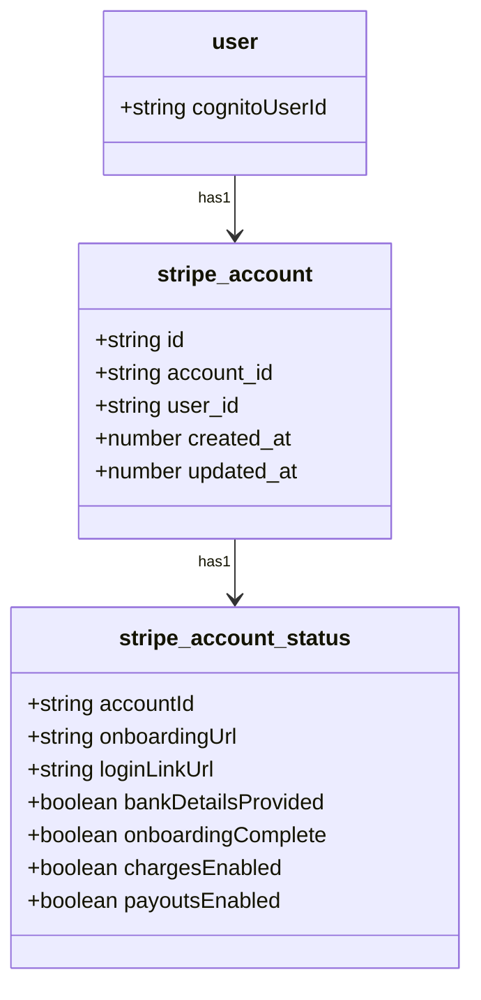
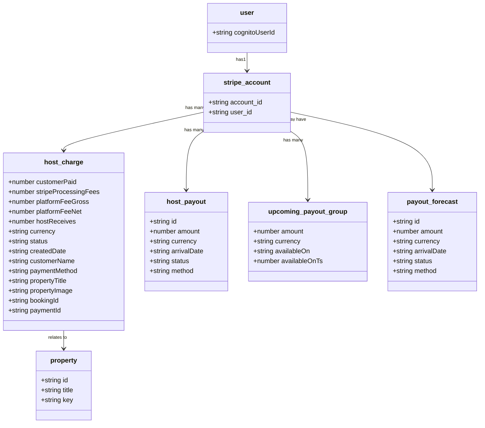
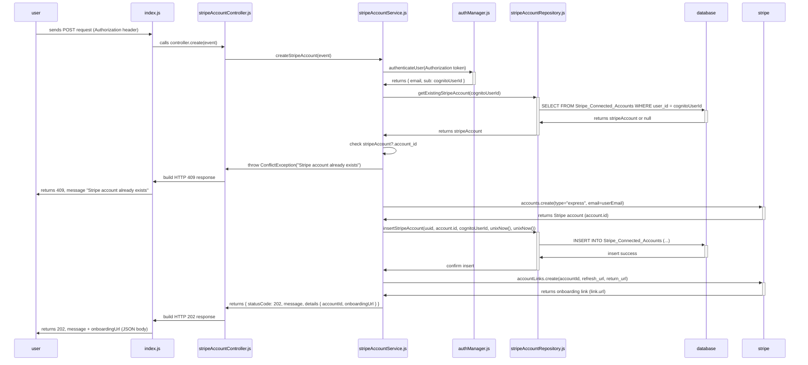
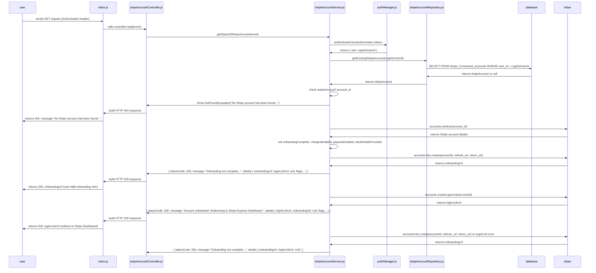
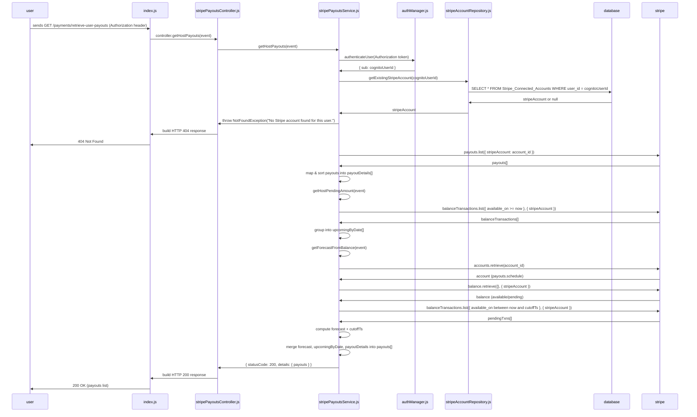
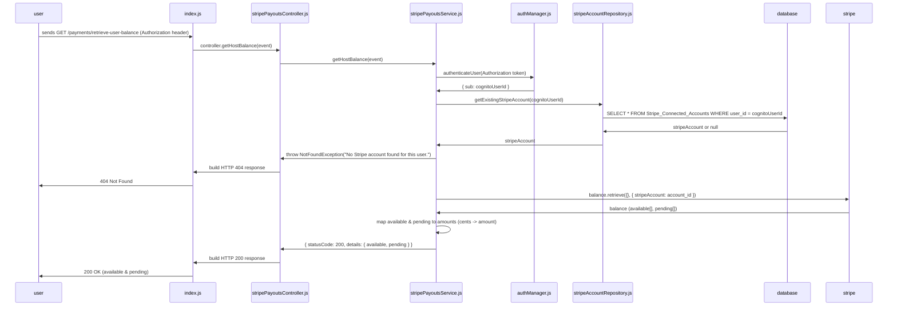
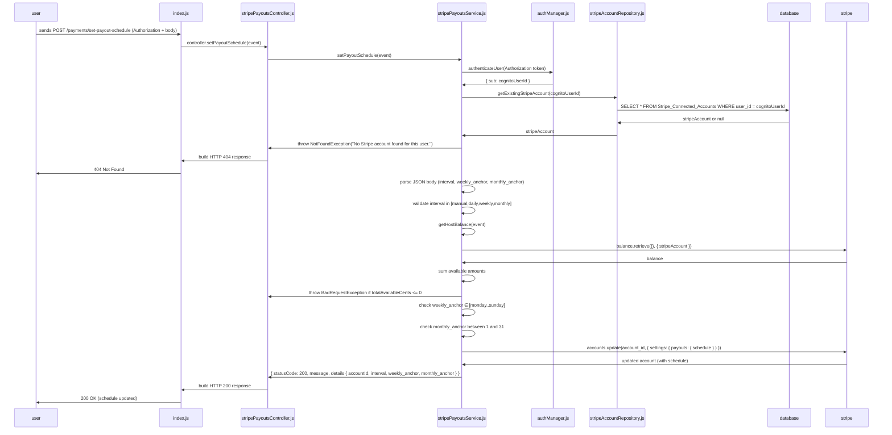
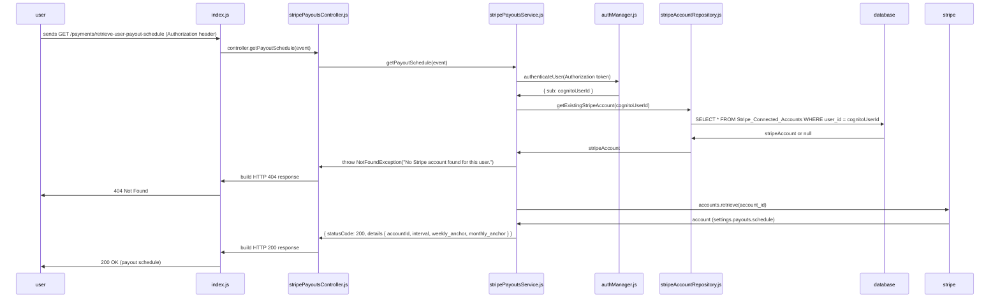

# Host finance (Stripe Account Management) docs

## Description

This documentation covers all operations related to Stripe Connect for hosts.  
It includes creating and managing Stripe Express accounts (onboarding, login access, and account status), as well as retrieving all payout-related financial data.  
This includes host charges, upcoming and completed payouts, balance information, payout forecasting, and managing payout schedules (daily, weekly, monthly).

## Metadata

Lambda Functions:

- `general-crud-payment-handler` Handles creation and status retrieval of Stripe Express accounts for hosts
- `General-Payments-Production-CRUD-fetchHostPayout` Shows lists charges transferred from bookings made by guests, retrieves past and upcoming payouts (including forecast based on balance and payout schedule), returns current Stripe balance (available and pending), and allows reading and updating the host’s Stripe payout schedule (daily/weekly/monthly/manual).

Related Issue: **Main issue: [#163](https://github.com/domits1/Domits/issues/163)**

Status: **In Development/Active**

## Working Endpoints

Use https://tabletomarkdown.com/generate-markdown-table/ to simply make your own table.

| Lambda function                                    | Action | Description                                                                                                         | Auth Required | Endpoint                                                                                                  |
| -------------------------------------------------- | ------ | ------------------------------------------------------------------------------------------------------------------- | ------------- | --------------------------------------------------------------------------------------------------------- |
| `general-crud-payment-handler`                     | POST   | Create a new Stripe Express account for the authenticated host                                                      | Yes           | https://hamuly8izh.execute-api.eu-north-1.amazonaws.com/development/payments                              |
| `general-crud-payment-handler`                     | GET    | Retrieve the current Stripe account status for the authenticated host                                               | Yes           | https://hamuly8izh.execute-api.eu-north-1.amazonaws.com/development/payments                              |
| `General-Payments-Production-CRUD-fetchHostPayout` | GET    | Retrieve the current Stripe balance (available and pending) for the authenticated host                              | Yes           | https://4ac2ngbvlb.execute-api.eu-north-1.amazonaws.com/deployment/payments/retrieve-user-balance         |
| `General-Payments-Production-CRUD-fetchHostPayout` | GET    | Retrieve all charges paid out to the authenticated host (per booking)                                               | Yes           | https://4ac2ngbvlb.execute-api.eu-north-1.amazonaws.com/deployment/payments/retrieve-user-charges         |
| `General-Payments-Production-CRUD-fetchHostPayout` | GET    | Retrieve the current Stripe payout schedule for the authenticated host                                              | Yes           | https://4ac2ngbvlb.execute-api.eu-north-1.amazonaws.com/deployment/payments/retrieve-user-payout-schedule |
| `General-Payments-Production-CRUD-fetchHostPayout` | GET    | Retrieve payouts, including past payouts, upcoming payouts and forecasted payout amounts for the authenticated host | Yes           | https://4ac2ngbvlb.execute-api.eu-north-1.amazonaws.com/deployment/payments/retrieve-user-payouts         |
| `General-Payments-Production-CRUD-fetchHostPayout` | POST   | Update the Stripe payout schedule (manual, daily, weekly, monthly) for the authenticated host                       | Yes           | https://4ac2ngbvlb.execute-api.eu-north-1.amazonaws.com/deployment/payments/set-payout-schedule           |

## Security & Authorization

Authorization will use your access_token.

_How to grab your access token?_

1. Head to domits.com, acceptance.domits.com or if you're running localhost, localhost
2. Open the Dev console (CTRL+SHIFT+I)
3. Click the application tab, copy the token from **CognitoIdentityServiceProvider**.xxxxxxxxxxxxxxxx...**accessToken**
4. Copy and paste this into your request as header (If you're using Postman or any API application to invoke the request, be aware that the accessToken resets every hour.)

## Class Diagram

Show your class in a Diagram. Use [Mermaid Flow](https://mermaid.live/). Github supports mermaid chart in .md

### Example `general-crud-payment-handler`:



### Example `General-Payments-Production-CRUD-fetchHostPayout`:



## Sequence Diagram

Use [Mermaid Live Editor](https://mermaid.live/) and its examples to make a Sequence Diagram for a POST request

### POST sequence diagram (`general-crud-payment-handler`)



### GET sequence diagram (`general-crud-payment-handler` )



<hr>

### GET sequence diagram (`retrieve-user-charges` → `General-Payments-Production-CRUD-fetchHostPayout`)

```marmaid
sequenceDiagram
    %% GET host charges (transfers to connected account)
    participant user
    participant index.js
    participant stripePayoutsController.js
    participant stripePayoutsService.js
    participant authManager.js
    participant stripeAccountRepository.js
    participant database
    participant propertyRepository.js
    participant stripe

    user->>index.js: sends GET /payments/retrieve-user-charges (Authorization header)
    index.js->>stripePayoutsController.js: controller.getHostCharges(event)
    stripePayoutsController.js->>stripePayoutsService.js: getHostCharges(event)

    stripePayoutsService.js->>authManager.js: authenticateUser(Authorization token)
    authManager.js->>stripePayoutsService.js: { sub: cognitoUserId }

    stripePayoutsService.js->>stripeAccountRepository.js: getExistingStripeAccount(cognitoUserId)
    stripeAccountRepository.js->>database: SELECT * FROM Stripe_Connected_Accounts WHERE user_id = cognitoUserId
    database->>stripeAccountRepository.js: stripeAccount or null
    stripeAccountRepository.js->>stripePayoutsService.js: stripeAccount

    %% Scenario: no Stripe account
    stripePayoutsService.js->>stripePayoutsController.js: throw NotFoundException("No Stripe account found for this user.")
    stripePayoutsController.js->>index.js: build HTTP 404 response
    index.js->>user: 404 Not Found

    %% Scenario: Stripe account exists -> load transfers
    stripePayoutsService.js->>stripe: transfers.list({ destination: account_id, expand: [...] })
    stripe->>stripePayoutsService.js: transfers[]

    %% For each transfer: compute financials + load property
    stripePayoutsService.js->>propertyRepository.js: getProperty(propertyId from charge.metadata)
    propertyRepository.js->>database: SELECT title, key FROM Property LEFT JOIN Property_Image ...
    database->>propertyRepository.js: { title, key }
    propertyRepository.js->>stripePayoutsService.js: property

    stripePayoutsService.js->>stripePayoutsController.js: { statusCode: 200, details: { charges: [...] } }
    stripePayoutsController.js->>index.js: build HTTP 200 response
    index.js->>user: 200 OK (charges list)
```
### GET sequence diagram (`retrieve-user-payouts` → `General-Payments-Production-CRUD-fetchHostPayout`)


### GET sequence diagram (`retrieve-user-balance` → `General-Payments-Production-CRUD-fetchHostPayout`)


### POST sequence diagram (`set-payout-schedule` → `General-Payments-Production-CRUD-fetchHostPayout`)


### GET sequence diagram (`retrieve-user-payout-schedule` → `General-Payments-Production-CRUD-fetchHostPayout`)


## Todo & Improvements

Todo:

- [ ] Make it more clearer for future devs and ask feedback to current devs if this is clear enough
