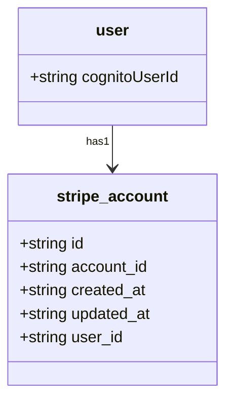
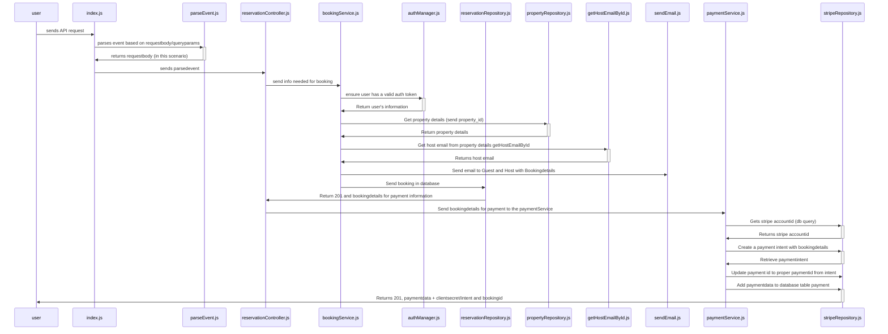

# Stripe Account Management docs

## Description

This documentation describes the operations related to creating and managing Stripe Express accounts for hosts. It covers account creation, onboarding, login link generation, and retrieving the status of a host’s Stripe account.  

## Metadata

Lambda Function: `general-crud-payment-handler`

Related Issue: **Main issue: [#163](https://github.com/domits1/Domits/issues/163)**

Status: **In Development/Active**

## Working Endpoints

Use https://tabletomarkdown.com/generate-markdown-table/ to simply make your own table.

| Action | Description                                                           | Auth Required | Endpoint                                                                     |
| ------ | --------------------------------------------------------------------- | ------------- | ---------------------------------------------------------------------------- |
| POST   | Create a new Stripe Express account for the authenticated user        | Yes           | https://hamuly8izh.execute-api.eu-north-1.amazonaws.com/development/payments |
| GET    | Retrieve the current Stripe account status for the authenticated user | Yes           | https://hamuly8izh.execute-api.eu-north-1.amazonaws.com/development/payments |

## Security & Authorization

Authorization will use your access_token.

_How to grab your access token?_

1. Head to domits.com, acceptance.domits.com or if you're running localhost, localhost
2. Open the Dev console (CTRL+SHIFT+I)
3. Click the application tab, copy the token from **CognitoIdentityServiceProvider**.xxxxxxxxxxxxxxxx...**accessToken**
4. Copy and paste this into your request as header (If you're using Postman or any API application to invoke the request, be aware that the accessToken resets every hour.)

## Class Diagram

Show your class in a Diagram. Use [Mermaid Flow](https://mermaid.live/). Github supports mermaid chart in .md

Example:

## Sequence Diagram

Use [Mermaid Live Editor](https://mermaid.live/) and its examples to make a Sequence Diagram for a POST request

### POST sequence diagram

## Todo & Improvements

Todo:

- [ ] Add GET requests as sequence diagram
- [ ] Finish the rest of the documentation
