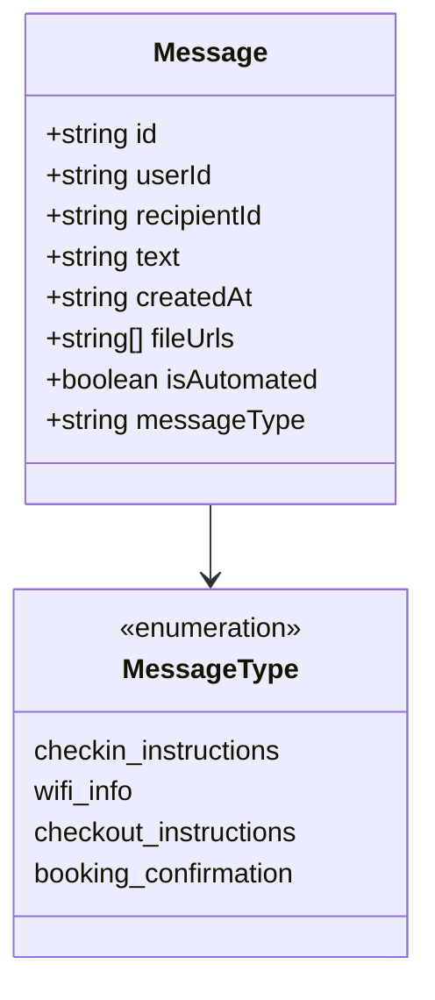
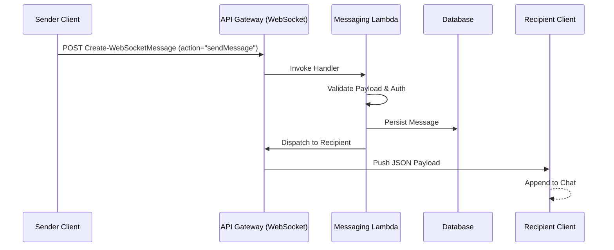

# Messaging Backend API

## Description
Domits messaging relies on AWS API Gateway (WebSocket + REST) and Lambda handlers in the bookings domain to create and dispatch messages. Automated messages reuse the same pipeline. This service handles real-time communication between users (hosts and guests) and automated system notifications.

## Metadata
Lambda Function: `General-Messaging-Production-Create-WebSocketMessage`, `General-Messaging-Production-Read-MessagesHistory`

Related issues: #89 (host) and #749 (guest)

Status: **Active**

## Working Endpoints

| Action | Description                                      | Auth Required | Endpoint                                            |
| ------ | ------------------------------------------------ | ------------- | --------------------------------------------------- |
| POST   | Create message (WebSocket entry)                 | Yes           | /General-Messaging-Production-Create-WebSocketMessage |
| POST   | Read history                                     | Yes           | /General-Messaging-Production-Read-MessagesHistory    |

## Security & Authorization
Authorization is handled via AWS Cognito Access Tokens. 
- **WebSocket Connection**: Requires valid user authentication.
- **Message Dispatch**: Validates `userId` and `recipientId`.

## Calculation / Logic Overview
### Message Flow
1. **Client Action**: Client calls `Create-WebSocketMessage` with `action=sendMessage`.
2. **Processing**: Lambda validates the payload, persists the message to the database.
3. **Dispatch**: The message is dispatched to the recipient via the API Gateway WebSocket connection.
4. **Receipt**: The recipient’s client receives the JSON payload on the open socket and appends it to the chat.
5. **History**: Chat history can be queried via `Read-MessagesHistory`.

### Automated Messages
- **Triggers**: Booking lifecycle events (confirmation, check-in, Wi‑Fi info, check-out).
- **Templates**: Align with demos in `demo-automated-messages.js` and runners in `run-immediate-messaging-test.js`.

## Class Diagram



## Sequence Diagram
### Send Message Flow



## Request Examples

### POST Create Message (WebSocket)
**Endpoint**: `https://tgkskhfz79.execute-api.eu-north-1.amazonaws.com/General-Messaging-Production-Create-WebSocketMessage`

```json
{
  "action": "sendMessage",
  "userId": "user-uuid",
  "recipientId": "recipient-uuid",
  "text": "Hello, how are you?",
  "propertyId": "optional-property-uuid",
  "isAutomated": false,
  "fileUrls": ["https://example.com/image.png"]
}
```

### POST Read History
**Endpoint**: `https://8pwu9lnge0.execute-api.eu-north-1.amazonaws.com/General-Messaging-Production-Read-MessagesHistory`

```json
{
  "userId": "user-uuid",
  "recipientId": "recipient-uuid"
}
```

## Message Schema (Server Side)
Fields commonly observed in tests and clients:

```json
{
  "id": "uuid",
  "userId": "sender",
  "recipientId": "receiver",
  "text": "message",
  "createdAt": "ISO timestamp",
  "fileUrls": ["https://..."],
  "isAutomated": true,
  "messageType": "checkin_instructions|wifi_info|checkout_instructions|booking_confirmation"
}
```

## Todo & Improvements
- [ ] Verify location of automated message service code (previously documented as `backend/functions/General-Bookings-CRUD-Bookings-develop/business/automatedMessageService.js` but not found).
- [ ] Add detailed response examples.
- [ ] Document error codes and handling.
