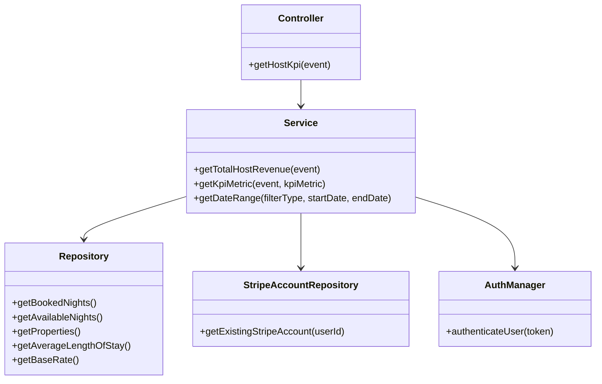

## Host KPI Metrics API

### Description

The Host KPI Metrics API provides performance analytics for property owners by calculating insights such as total revenue, occupancy rate, average daily rate, and more. It leverages Stripe payout data combined with booking records to help hosts track their business performance over time.

### Metadata

| Field           | Value          |
| --------------- | -------------- |
| Lambda Function | Handler        |
| Related issue   | # 134         |
| Status          | In Development |

### Working Endpoints

https://3biydcr59g.execute-api.eu-north-1.amazonaws.com/default/

| Action | Description         | Auth Requierd | url | Endpoint                                                                               |
| ------ | ------------------- | ------------- | --- | -------------------------------------------------------------------------------------- |
| GET    | Retrieve KPI metric | Yes           |     | /hostKpi?metric=<metric>&filterType=<type>&startDate=<dd-mm-yyyy>&endDate=<dd-mm-yyyy> |

### Security & Authorization

Uses Bearer Token in the Authorization header.

Authentication handled via AWS Cognito using AuthManager.authenticateUser.

Only users with a valid Stripe account (account_id) can retrieve host-related metrics.

Errors are thrown for:
* Missing authentication token
* Invalid/missing user ID
* Missing Stripe account link

### Calculation / Logic Overview

1. User Authentication & Validation
* Validate token → extract cognitoUserId.
* Retrieve and validate Stripe account.

2. Revenue Calculation
* Use stripe.transfers.list() for transfers targeting user's Stripe account.
* Formula:
Revenue = Sum(amount transferred – platform fee)
Formatted using de-DE locale.

3. KPI Metric Computations

| Metric | Formula |
|--------|---------|
| `revenue` | Sum(amount transferred − platform fee) |
| `bookedNights` | Total booked nights |
| `availableNights` | (Days in period × properties) − booked days |
| `averageDailyRate` | revenue / bookedNights |
| `occupancyRate` | (bookedNights / availableNights) × 100 |
| `revenuePerAvailableRoom` | ADR × (occupancyRate / 100) |
| `propertyCount` | Number of host-owned properties |
| `averageLengthOfStay` | Average days per booking |
| `ratesApi` | Base rate per property |

4. Date Filtering Logic

| filterType | Range |
|------------|-------|
| `weekly` | Monday → Sunday |
| `monthly` | First → Last day of current month |
| `custom` | Requires `startDate` & `endDate` (dd-mm-yyyy) |

---

## Class Diagram



## Request Examples

### Get

```javascript

async function main() {
  console.log(
    await handler({
      httpMethod: "GET",
      headers: {
        Authorization:
          "",
      },
      body: {
        hostId: "",
      },
      queryStringParameters: {
        metric: "",
        filterType: "",
      },
    })
  );
}

```

### GET – Revenue (Weekly)
```http
GET /hostKpi?metric=revenue&filterType=weekly
Authorization: Bearer <token>
```

### Example Response
```json
{
  "revenue": "3.450,00"
}

