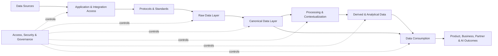

# Domits Data Foundation

## Feature Summary

Domits' data foundation unifies marketplace, PMS, finance, partner, and product data into a secure, standardized platform. The goal is to support reliable analytics, AI capabilities, operational workflows, and seamless guest and host experiences.

This document describes the target data foundation for Domits and connects the database, integration, governance, analytics, and AI layers into one shared architecture.

## Goals

The Domits data foundation should provide:

- A single source of truth for core business entities.
- Standardized data access across guest, host, admin, finance, and partner domains.
- Consistent reporting and KPI definitions.
- Secure and auditable access to sensitive data.
- Scalable integration with OTAs, payment providers, identity providers, and partner APIs.
- Clean and enriched datasets for analytics, machine learning, and GenAI features.
- Support for both operational workloads and analytical workloads.

## Scope

This data foundation covers:

- Marketplace data.
- Guest data.
- Host data.
- Property data.
- Booking and reservation data.
- Availability and pricing data.
- Messaging data.
- Payments and payout data.
- Reviews and ratings.
- Partner and third-party integration data.
- Operational events and product analytics events.
- Derived metrics and AI-ready datasets.

## Architecture Overview

Domits' unified data platform can be viewed as the following flow:

