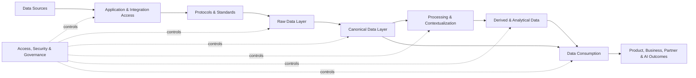

# Domits Data Foundation

## Feature Summary

Domits' data foundation unifies marketplace, PMS, finance, partner, and product data into a secure, standardized platform. The goal is to support reliable analytics, AI capabilities, operational workflows, and seamless guest and host experiences.

This document describes the target data foundation for Domits and connects the database, integration, governance, analytics, and AI layers into one shared architecture.

## Goals

The Domits data foundation should provide:

- A single source of truth for core business entities.
- Standardized data access across guest, host, admin, finance, and partner domains.
- Consistent reporting and KPI definitions.
- Secure and auditable access to sensitive data.
- Scalable integration with OTAs, payment providers, identity providers, and partner APIs.
- Clean and enriched datasets for analytics, machine learning, and GenAI features.
- Support for both operational workloads and analytical workloads.

## Scope

This data foundation covers:

- Marketplace data.
- Guest data.
- Host data.
- Property data.
- Booking and reservation data.
- Availability and pricing data.
- Messaging data.
- Payments and payout data.
- Reviews and ratings.
- Partner and third-party integration data.
- Operational events and product analytics events.
- Derived metrics and AI-ready datasets.

## Architecture Overview

Domits' unified data platform can be viewed as the following flow:

The platform separates raw ingestion, canonical operational data, business processing, and analytical consumption. This separation makes it easier to scale integrations, improve reporting reliability, and protect sensitive data.

## Data Sources

Domits collects data from internal platform applications and external partner systems.

### Core Platform Sources

| Source | Data Examples | Purpose |
|---|---|---|
| Guest App / Web | Searches, bookings, messages, reviews, profile data | Guest experience, conversion tracking, personalization |
| Host Dashboard | Listings, availability, pricing, payout settings, host profile | Property management and host operations |
| Admin & Ops Tools | Support actions, trust and safety reviews, manual corrections | Operational control and auditability |
| Booking Engine | Reservations, booking status, cancellations, guest counts | Core marketplace transaction flow |
| Messaging / Unified Inbox | Message threads, participants, channel metadata | Guest-host communication and support context |
| Payments & Payouts | Payment intents, transactions, refunds, payout records | Finance, reconciliation, and reporting |
| Reviews & Ratings | Review scores, written feedback, moderation status | Trust, ranking, and quality monitoring |

### External / Partner Sources

| Source | Data Examples | Purpose |
|---|---|---|
| OTAs | Airbnb, Booking.com, Expedia reservations and listing data | Cross-channel visibility and synchronization |
| Channel Managers | Availability, rates, restrictions, reservations | PMS and OTA connectivity |
| Payment Providers | Stripe, Adyen payments, refunds, disputes, payouts | Financial processing and reconciliation |
| Identity Providers | Auth0, Cognito identity and authentication metadata | Secure login and identity management |
| Pricing & Market Data APIs | Market rates, demand indicators, seasonality | Revenue management and pricing intelligence |
| Analytics & Marketing Tools | Campaign attribution, conversion events | Growth analytics and funnel optimization |
| Third-Party Services | Verification, fraud, geo, communication services | Data enrichment and operational workflows |

## Application & Integration Access

The purpose of this layer is to collect data from every relevant touchpoint in near-real-time or through scheduled synchronization.

### Access Patterns

| Access Pattern | Use Case |
|---|---|
| REST APIs | Standard request-response access for internal and partner systems |
| GraphQL APIs | Flexible client-driven access for frontend and mobile applications |
| Webhooks | Event notifications from payment providers, OTAs, identity systems, and partners |
| Event Streams | High-volume booking, payment, message, search, click, and conversion events |
| Batch Imports | CSV uploads, historical imports, partner exports, scheduled API syncs |
| SDKs | Mobile and web event capture, analytics, and client-side integrations |
| Partner APIs | OTA, channel manager, finance, identity, and third-party integrations |

## Protocols & Standards

Domits should standardize how data enters, moves through, and exits the platform.

| Standard | Role |
|---|---|
| HTTPS / REST | Secure synchronous API communication |
| GraphQL | Flexible application-facing data queries |
| Webhooks | Push-based external system notifications |
| JSON | Common data exchange format |
| JSON Schema | Validation of event and integration payloads |
| OAuth2 | Secure delegated authorization |
| OpenID Connect | Identity and authentication standardization |
| CloudEvents | Standard structure for event-driven data payloads |

## Core Data Layer

The core data layer is the Domits Unified Data Platform. This is where data is stored, normalized, validated, and enriched.

The platform should support two main data categories:

1. Raw data.
2. Standardized canonical data.

## Raw Data Layer

The raw data layer stores source-aligned data before full normalization or business transformation. It is useful for traceability, debugging, partner reconciliation, and reprocessing.

### Raw Data Examples

| Raw Data Type | Description |
|---|---|
| Raw bookings | Original booking payloads from Domits, OTAs, and channel managers |
| Raw messages | Source-specific message payloads and delivery metadata |
| Raw payments | Payment provider events, transaction payloads, refunds, and disputes |
| Raw availability & pricing | Incoming rates, restrictions, and calendar changes |
| Raw events | Search, click, conversion, product analytics, and operational events |

### Raw Layer Principles

- Preserve the original source payload when useful for auditing and replay.
- Store source system, received timestamp, processing status, and correlation identifiers.
- Avoid using raw payloads directly for core product features.
- Promote validated and mapped data into canonical tables or canonical events.

## Standardized / Canonical Data

Canonical data represents Domits' normalized internal view of the business. It should hide source-specific differences and provide stable entities for product, finance, analytics, and AI use cases.

### Canonical Entities

| Canonical Entity | Purpose |
|---|---|
| Canonical User | Shared representation of guests, hosts, admins, and external identities |
| Canonical Property | Standard representation of listings, location, amenities, rules, images, and property metadata |
| Canonical Booking | Unified reservation lifecycle across Domits and external channels |
| Canonical Transaction | Normalized payments, refunds, fees, commissions, and payout records |
| Canonical Message Thread | Unified conversation structure across direct and partner channels |

### Canonical Layer Principles

- Use stable primary keys and clear foreign key relationships.
- Reduce duplication through normalization.
- Keep source-specific identifiers in mapping tables where needed.
- Define ownership for each canonical domain.
- Apply validation before data becomes part of the canonical model.

## Data Processing & Contextualization

The business logic and intelligence layer turns raw and canonical data into meaningful operational and analytical context.

### Processing Responsibilities

| Responsibility | Description |
|---|---|
| Data standardization | Convert incoming payloads into Domits naming, types, and structures |
| Currency normalization | Store original currency and normalized reporting currency where required |
| Timezone normalization | Preserve local property time while supporting UTC-based processing |
| Channel-specific mapping | Map external OTA or channel manager concepts into Domits canonical concepts |
| Data enrichment | Add geo, seasonality, market, segmentation, and risk context |
| KPI calculation | Produce consistent business metrics across dashboards and reports |

### KPI Definitions

| KPI | Definition |
|---|---|
| Occupancy | Booked nights divided by available nights for a property or group of properties |
| ADR | Average Daily Rate: room or stay revenue divided by booked nights |
| RevPAR | Revenue per Available Rental/Night: revenue divided by available nights |
| Conversion Rate | Completed target actions divided by total relevant sessions or opportunities |
| Cancellation Rate | Cancelled bookings divided by total bookings within a defined period |
| Host Earnings | Host-facing net earnings after applicable fees, adjustments, and payouts |
| Platform Take Rate | Platform revenue divided by gross booking value or another agreed finance baseline |

KPI formulas must be defined once and reused across dashboards, exports, analytics, and AI insights.

## Derived & Analytical Data

Derived and analytical data supports reporting, forecasting, optimization, and machine learning.

| Dataset Type | Examples |
|---|---|
| Aggregated metrics | Daily bookings, revenue, occupancy, conversion, payout totals |
| Historical trends | Seasonal demand, cancellation patterns, host performance, market movement |
| Forecast datasets | Demand forecasts, expected occupancy, pricing recommendations |
| ML feature sets | Pricing, fraud, churn, ranking, recommendation, and trust signals |
| Embeddings for GenAI | Property search, guest preference matching, support summaries, host insights |

Derived datasets should be traceable back to canonical data and, when relevant, raw source records.

## Analytics & Warehousing

Domits should distinguish between operational and analytical data workloads.

| Concept | Domits Usage |
|---|---|
| OLTP | Operational transactional data such as bookings, users, properties, messages, and payments |
| OLAP | Analytical querying across historical and aggregated data |
| Data Warehouse | Curated analytical storage for business reporting and finance analysis |
| Data Lake | Raw and semi-structured storage for events, partner payloads, logs, and ML pipelines |
| Fact Table | Measurable business events such as bookings, transactions, messages, and availability changes |
| Dimension Table | Descriptive context such as users, properties, dates, channels, markets, and partners |
| Star Schema | Simple analytical model with fact tables connected to dimensions |
| Snowflake Schema | More normalized analytical model where dimensions are split into related tables |

A future analytical model should prioritize consistent KPI definitions, reliable finance reporting, and scalable AI/ML feature generation.

## Data Consumption

Domits data is consumed by internal product teams, business operations, external partners, and automated intelligence systems.

### Internal Consumers

| Consumer | Data Usage |
|---|---|
| Host dashboards | Occupancy, earnings, calendar, booking performance, messages |
| Guest experience features | Search, recommendations, booking status, messaging, reviews |
| Admin & Trust & Safety | User activity, disputes, moderation, audit trails, risk indicators |
| Finance & Payouts | Transactions, refunds, fees, reconciliations, payout reporting |
| Operations & Support | Booking context, communication history, user and property details |

### External Consumers

| Consumer | Data Usage |
|---|---|
| Partner APIs | Controlled access to property, availability, booking, and message data |
| Reporting exports | Operational, finance, host, and partner reports |
| Regulatory reporting | Data required for local regulations, tax, and compliance processes |
| Accounting systems | Revenue, fees, refunds, payouts, and reconciliation data |

## Access & Security

Data access must be controlled by identity, role, ownership, and context.

### Access Controls

| Control | Description |
|---|---|
| Role-Based Access Control | Access based on Guest, Host, Admin, Finance, Support, or Partner roles |
| Host vs Guest Scopes | Guests only access their own bookings and messages; hosts access their own properties and related data |
| Admin Scopes | Admin access should be limited by operational need and logged |
| Property-Level Isolation | Host data access should be isolated by property ownership or management relationship |
| Partner Scopes | Partner integrations should only access approved data domains and operations |
| Audit Logs | Sensitive reads, writes, exports, and admin actions should be logged |
| GDPR / Retention Rules | Personal data should follow retention, deletion, and export requirements |

## Data Governance & Quality

Data governance ensures that Domits data remains reliable, understandable, and compliant.

| Governance Area | Domits Application |
|---|---|
| Integrity | Foreign keys, constraints, uniqueness rules, and validation |
| Validation | Input validation, payload validation, and schema validation |
| Lineage | Tracking where data came from and how it changed |
| Catalog | Documentation of important tables, events, owners, and definitions |
| Master Data | Trusted core entities such as users, properties, bookings, and transactions |
| Reference Data | Stable lookup data such as amenities, rules, property types, currencies, countries, and channels |

The existing table research in `2446-table-research.md` should be used as a reference for table-level validation, redundancy reduction, and schema improvement decisions.

## Simplified Data Access

### Domits Outcomes

The data foundation should enable:

- A single source of truth.
- Unified dashboards.
- Cross-channel visibility.
- Consistent reporting.
- Clear domain ownership.
- Safer and faster product development.

## Simplified Data Integration

### Domits Outcomes

The integration layer should enable:

- Standard APIs.
- Scalable microservices.
- Bidirectional OTA synchronization.
- Event-driven architecture.
- Faster partner onboarding.
- Clear contracts for internal and external data exchange.

## Simplified Analytics & AI

### Domits Outcomes

The analytics and AI layer should enable:

- Clean and enriched datasets.
- Historical and real-time context.
- KPI optimization.
- ML models for pricing, fraud, churn, ranking, and recommendations.
- GenAI features such as copilots, insights, summaries, search, and support assistance.

## Issue Checklist Mapping

| Issue Topic | Covered In This Document |
|---|---|
| Sources | Data Sources |
| Application & Integration Access | Application & Integration Access |
| Protocols & Standards | Protocols & Standards |
| Core Data Layer | Core Data Layer, Raw Data Layer, Standardized / Canonical Data |
| Data Processing & Contextualization | Data Processing & Contextualization |
| Derived & Analytical Data | Derived & Analytical Data |
| Data Consumption | Data Consumption |
| Access & Security | Access & Security |
| Simplified Data Access | Simplified Data Access |
| Simplified Data Integration | Simplified Data Integration |
| Simplified Analytics & AI | Simplified Analytics & AI |
| Analytics & Warehousing | Analytics & Warehousing |
| Data Governance & Quality | Data Governance & Quality |

Database-specific topics such as Aurora DSQL, ERD, normalization, indexing, transactions, ORM access, operations, and advanced data architecture terms are documented in `database_model.md`.

## Related Documentation

- `docs/internal/data/database_model.md`
- `docs/internal/data/2446-table-research.md`
- `docs/internal/tools/dsql_transitioning_docs.md`
- `docs/internal/tools/orm/usage.md`
- `docs/internal/tools/orm/our_implementation.md`
- `docs/internal/architecture/database_architecture_design.md`
