# Domits Database ERD

## Purpose

This document describes the updated Domits database Entity Relationship Diagram for the Aurora DSQL / PostgreSQL-compatible data model.

The previous ERD mainly covered users, properties, bookings, payments, amenities, rules, pricing, availability, and legacy image storage. The current database surface has expanded with unified messaging, channel integrations, sync state, property drafts, property tasks, standalone sites, KPI snapshots, calendar overrides, iCal sources, cancellation policies, and the newer image model.

This document should be used as the source for updating the visual Lucidchart ERD.

## Current ERD Status

The existing Lucidchart ERD is outdated because it does not fully represent the active TypeORM model set and migrations.
* Aurora DSQL Entity Relationship Diagram (ERD) Diagram https://lucid.app/lucidchart/f68b11d7-8ea1-42eb-80a3-2a76a1da2492/edit?invitationId=inv_1c6d44ed-fb13-413b-b392-625a493c157f&page=0_0#

### Covered in the old ERD

The old ERD covers these core areas:

- User
- Property
- Booking
- Payment
- Stripe connected accounts
- Property location
- Property pricing
- Property images
- Property technical details
- Property general details
- Property type
- Amenities
- Amenity categories
- Property amenities
- Rules
- Property rules
- Check-in data
- Availability
- Availability restrictions

### Missing or underrepresented in the old ERD

The updated ERD should also include:

- Property image v2 and image variants
- Property calendar prices
- Property calendar overrides
- Property iCal sources
- Booking cancellation policy
- Property cancellation policy
- Property drafts
- Property custom rules
- Property house rules
- Property tasks and task activity
- Host settings
- KPI snapshots
- Standalone site, domain, draft, and events
- Unified messaging threads and messages
- Unified collaboration notes
- Channel integration accounts
- Channel integration properties
- Channel reservation links
- Integration sync state
- Integration sync logs

## Entity Clusters

The updated ERD is grouped by domain so it is easier to maintain.

| Cluster | Tables / Models |
|---|---|
| Identity | `user_table`, `stripe_connectedaccounts`, `host_settings` |
| Property Core | `property`, `property_location`, `property_pricing`, `property_technicaldetails`, `property_test_status` |
| Property Details | `general_details`, `property_generaldetail`, `property_types`, `property_type` |
| Amenities & Rules | `amenities`, `amenity_categories`, `amenity_and_category`, `property_amenity`, `rules`, `property_rule`, `property_custom_rules`, `property_house_rules` |
| Images | `property_image`, `property_image_v2`, `property_image_variant` |
| Calendar & Availability | `property_availability`, `availability_restrictions`, `property_availabilityrestriction`, `property_calendar_price`, `property_calendar_override`, `property_ical_source`, `property_checkin` |
| Booking & Payment | `booking`, `payment`, `property_cancellation_policy` |
| Messaging | `unified_thread`, `unified_message`, `unified_thread_note` |
| Integrations | `channel_integration_account`, `channel_integration_property`, `channel_reservation_link`, `integration_sync_state`, `integration_sync_log` |
| Operations | `property_task`, `property_task_activity`, `kpi_snapshot` |
| Standalone Site | `standalone_site`, `standalone_site_draft`, `standalone_site_domain`, `standalone_site_event` |

## Updated High-Level ERD

```mermaid
erDiagram
    USER_TABLE ||--o{ PROPERTY : owns
    USER_TABLE ||--o{ BOOKING : books
    USER_TABLE ||--o{ STRIPE_CONNECTEDACCOUNTS : connects
    USER_TABLE ||--o{ HOST_SETTINGS : configures

    PROPERTY ||--o{ PROPERTY_LOCATION : has
    PROPERTY ||--o{ PROPERTY_PRICING : has
    PROPERTY ||--o{ PROPERTY_TECHNICALDETAILS : has
    PROPERTY ||--o{ PROPERTY_TEST_STATUS : has
    PROPERTY ||--o{ PROPERTY_GENERALDETAIL : has
    PROPERTY ||--o{ PROPERTY_TYPE : has
    PROPERTY ||--o{ PROPERTY_AMENITY : has
    PROPERTY ||--o{ PROPERTY_RULE : has
    PROPERTY ||--o{ PROPERTY_CUSTOM_RULES : has
    PROPERTY ||--o{ PROPERTY_HOUSE_RULES : has

    PROPERTY ||--o{ PROPERTY_IMAGE : has_legacy_images
    PROPERTY ||--o{ PROPERTY_IMAGE_V2 : has_images
    PROPERTY_IMAGE_V2 ||--o{ PROPERTY_IMAGE_VARIANT : has_variants

    PROPERTY ||--o{ PROPERTY_AVAILABILITY : has
    PROPERTY ||--o{ PROPERTY_AVAILABILITYRESTRICTION : has
    PROPERTY ||--o{ PROPERTY_CALENDAR_PRICE : has
    PROPERTY ||--o{ PROPERTY_CALENDAR_OVERRIDE : has
    PROPERTY ||--o{ PROPERTY_ICAL_SOURCE : syncs_from
    PROPERTY ||--o{ PROPERTY_CHECKIN : has

    PROPERTY ||--o{ BOOKING : receives
    BOOKING ||--o{ PAYMENT : has
    BOOKING ||--o{ UNIFIED_THREAD : relates_to
    BOOKING ||--o{ CHANNEL_RESERVATION_LINK : maps_to
    PROPERTY_CANCELLATION_POLICY ||--o{ BOOKING : applies_to

    UNIFIED_THREAD ||--o{ UNIFIED_MESSAGE : contains
    UNIFIED_THREAD ||--o{ UNIFIED_THREAD_NOTE : has
    USER_TABLE ||--o{ UNIFIED_MESSAGE : sends
    USER_TABLE ||--o{ UNIFIED_THREAD_NOTE : writes

    CHANNEL_INTEGRATION_ACCOUNT ||--o{ CHANNEL_INTEGRATION_PROPERTY : owns
    CHANNEL_INTEGRATION_PROPERTY ||--o{ CHANNEL_RESERVATION_LINK : maps
    CHANNEL_INTEGRATION_ACCOUNT ||--o{ INTEGRATION_SYNC_STATE : tracks
    CHANNEL_INTEGRATION_ACCOUNT ||--o{ INTEGRATION_SYNC_LOG : logs

    PROPERTY ||--o{ PROPERTY_TASK : has
    PROPERTY_TASK ||--o{ PROPERTY_TASK_ACTIVITY : has
    PROPERTY ||--o{ KPI_SNAPSHOT : summarizes

    PROPERTY ||--o{ PROPERTY_DRAFT : drafts
    PROPERTY ||--o{ STANDALONE_SITE : publishes
    STANDALONE_SITE ||--o{ STANDALONE_SITE_DRAFT : drafts
    STANDALONE_SITE ||--o{ STANDALONE_SITE_DOMAIN : has
    STANDALONE_SITE ||--o{ STANDALONE_SITE_EVENT : tracks

    AMENITIES ||--o{ PROPERTY_AMENITY : selected_by
    AMENITIES ||--o{ AMENITY_AND_CATEGORY : categorized_by
    AMENITY_CATEGORIES ||--o{ AMENITY_AND_CATEGORY : groups
    RULES ||--o{ PROPERTY_RULE : selected_by
    GENERAL_DETAILS ||--o{ PROPERTY_GENERALDETAIL : selected_by
    PROPERTY_TYPES ||--o{ PROPERTY_TYPE : selected_by

    USER_TABLE {
        string id
    }

    PROPERTY {
        string id
        string hostid
        string title
        string subtitle
        string description
        number guestCapacity
        string status
        number createdAt
        number updatedAt
    }

    BOOKING {
        string id
        number arrivaldate
        number departuredate
        number createdat
        string guestid
        int guests
        string hostid
        bool latepayment
        string paymentid
        string property_id
        string status
        string guestname
        string hostname
        string cancellation_policy
    }

    PAYMENT {
        string stripePaymentId
        string stripeClientSecret
    }

    STRIPE_CONNECTEDACCOUNTS {
        string id
        string account_id
        string created_at
        string updated_at
        string user_id
    }

    PROPERTY_LOCATION {
        string property_id
        string country
        string city
        string street
        string postalCode
    }

    PROPERTY_PRICING {
        string property_id
        number roomRate
        number weekendRate
        number cleaning
        number service
    }

    PROPERTY_TECHNICALDETAILS {
        string property_id
        number length
        number height
        number fuelConsumption
        number speed
        number renovationYear
        string transmission
        number generalPeriodicInspection
        boolean fourWheelDrive
    }

    PROPERTY_TEST_STATUS {
        string property_id
    }

    GENERAL_DETAILS {
        string detail
    }

    PROPERTY_GENERALDETAIL {
        string property_id
        string detail
        number value
    }

    PROPERTY_TYPES {
        string type
    }

    PROPERTY_TYPE {
        string property_id
        string property_type
        string spaceType
    }

    AMENITIES {
        string amenity
    }

    AMENITY_CATEGORIES {
        string category
    }

    AMENITY_AND_CATEGORY {
        string id
        string category
        string amenity
    }

    PROPERTY_AMENITY {
        string id
        string property_id
        string amenityId
    }

    RULES {
        string rule
    }

    PROPERTY_RULE {
        string property_id
        string rule
        boolean value
    }

    PROPERTY_CUSTOM_RULES {
        string id
        string property_id
    }

    PROPERTY_HOUSE_RULES {
        string id
        string property_id
    }

    PROPERTY_IMAGE {
        string property_id
        string key
    }

    PROPERTY_IMAGE_V2 {
        string id
        string property_id
    }

    PROPERTY_IMAGE_VARIANT {
        string id
        string image_id
    }

    PROPERTY_AVAILABILITY {
        string property_id
        number availableStartDate
        number availableEndDate
    }

    AVAILABILITY_RESTRICTIONS {
        string restriction
    }

    PROPERTY_AVAILABILITYRESTRICTION {
        string property_id
        string restriction
        number value
    }

    PROPERTY_CALENDAR_PRICE {
        string property_id
    }

    PROPERTY_CALENDAR_OVERRIDE {
        string id
        string property_id
    }

    PROPERTY_ICAL_SOURCE {
        string id
        string property_id
    }

    PROPERTY_CHECKIN {
        string property_id
    }

    PROPERTY_CANCELLATION_POLICY {
        string id
        string property_id
    }

    PROPERTY_DRAFT {
        string id
        string property_id
    }

    HOST_SETTINGS {
        string id
        string host_id
    }

    UNIFIED_THREAD {
        string id
        string booking_id
    }

    UNIFIED_MESSAGE {
        string id
        string thread_id
        string sender_id
    }

    UNIFIED_THREAD_NOTE {
        string id
        string thread_id
        string user_id
    }

    CHANNEL_INTEGRATION_ACCOUNT {
        string id
        string provider
    }

    CHANNEL_INTEGRATION_PROPERTY {
        string id
        string account_id
        string property_id
    }

    CHANNEL_RESERVATION_LINK {
        string id
        string property_id
        string booking_id
    }

    INTEGRATION_SYNC_STATE {
        string id
        string account_id
    }

    INTEGRATION_SYNC_LOG {
        string id
        string account_id
    }

    PROPERTY_TASK {
        string id
        string property_id
    }

    PROPERTY_TASK_ACTIVITY {
        string id
        string task_id
    }

    KPI_SNAPSHOT {
        string id
        string property_id
    }

    STANDALONE_SITE {
        string id
        string property_id
    }

    STANDALONE_SITE_DRAFT {
        string id
        string site_id
    }

    STANDALONE_SITE_DOMAIN {
        string id
        string site_id
    }

    STANDALONE_SITE_EVENT {
        string id
        string site_id
    }
```

