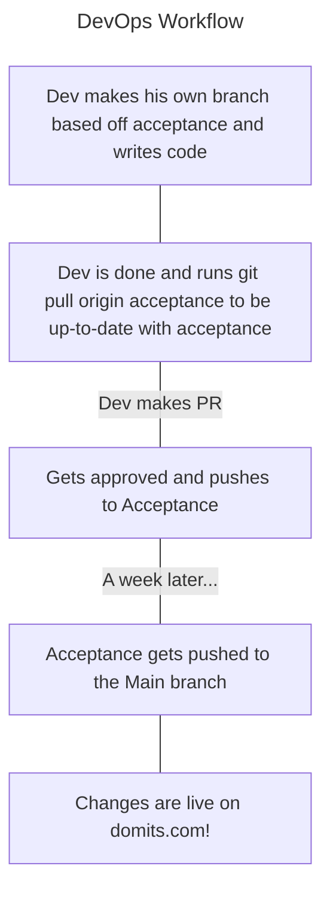

# Devops Workflow

## 1. Workflow Overview

The workflow for writing code is as following:
1. Developer makes a branch based of acceptance and eventually
2. Developer writes code locally while making commits.
3. Dev completes a issue and tests it locally.
4. Dev makes a Pull Request and gets the PR reviewed
5. The PR is reviewed, and eventually the PR is approved, or changes are proposed by reviewers.
6. Test checks will be run. More about that in [About Checks](#about-checks)
7. If the PR approves, the PR gets pushed to Acceptance.
8. Eventually the workflow goes behind the scenes with the following for those two parts:

**Frontend CI/CD**  

Once merged to acceptance, Amplify will see this and build and deploy the project based on your changes. You can see if this passes/checks here

**Backend CI/CD**

Uses Github Runner/Actions to automate this workflow
1. Finds the previous commit to compare against for detecting changes
2. Setups node.js and installs all dependencies
3. Sets all credentials from AWS
4. Identifies which files have been changed since the previous commit
5. Finds and deployes all modified Lambda functions (Communicates with the AWS SDK to automate this)
6. Passes, or fails.
   
### About checks...

The following CI checks are present:
* Node.js CI / build (pull_request)
* SonarCloud Code Analysis
* CI - Test Lambda Functions / Run Unit Tests (pull_request)
* CI - Test Lambda Functions / Setup Environment (pull_request)
* CI - Test Lambda Functions / Validate AWS Lambda Functions (pull_request)

The one which is not important is SonarCloud Code Analysis. What is important are the other 4 functions. Simply said, if they don't get approved, that means something is going wrong and things will break even if you merge. So that means that its the responsibility of the PR requester to fix things up.

