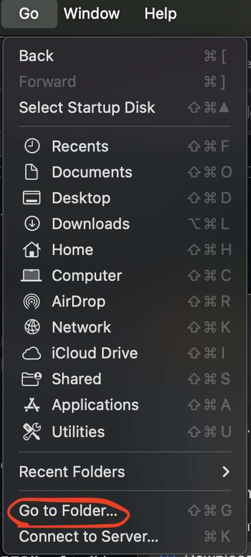
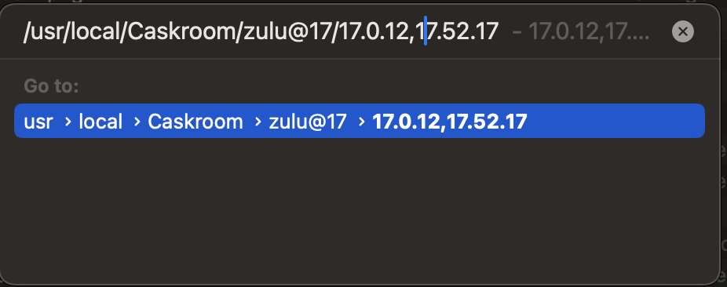
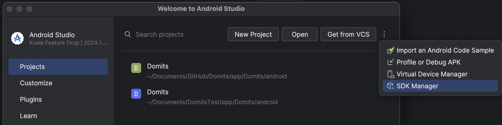
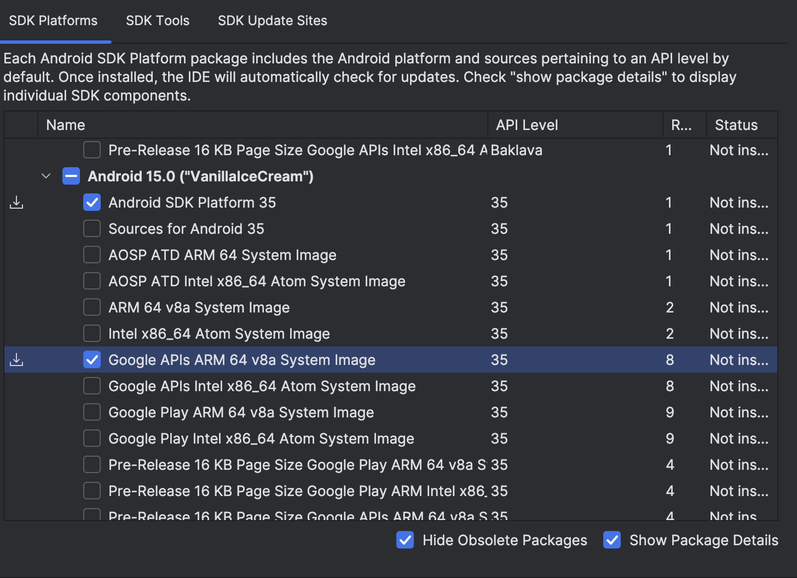
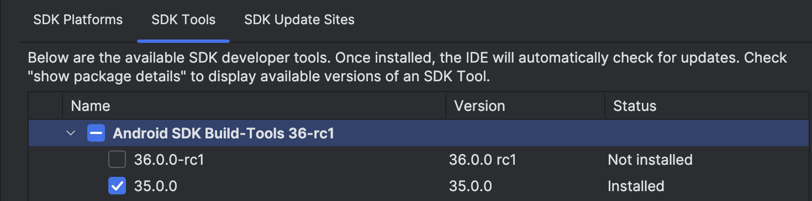
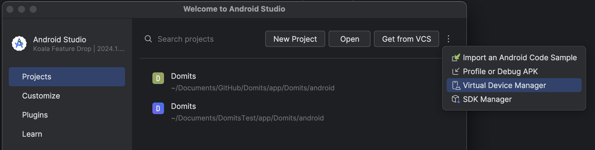
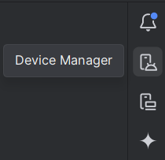

# Android Development Setup for macOS
You can find more information about setting up a React-Native project in the [Official React Native Documentation](https://reactnative.dev/docs/set-up-your-environment?os=macos&platform=android).

# Table of Contents
<!-- TOC -->
  * [Step 1 - Install Homebrew](#step-1---install-homebrew)
  * [Step 2 - Install Dependencies](#step-2---install-dependencies)
  * [Step 3 - Install JDK](#step-3---install-jdk)
  * [Step 4 - Install Android Studio](#step-4---install-android-studio)
  * [Step 5 - Configure the Android SDK](#step-5---configure-the-android-sdk)
  * [Step 6 - Configure Environment Variables](#step-6---configure-environment-variables)
  * [Step 7 - Preparing the Android device](#step-7---preparing-the-android-device)
  * [Step 8 - Starting the App](#step-8---starting-the-app)
<!-- TOC -->

## Step 1 - Install Homebrew
1. Run the following code (in your terminal) if you haven't downloaded [Homebrew](https://brew.sh/) yet:
   ```cmd
   /bin/bash -c "$(curl -fsSL https://raw.githubusercontent.com/Homebrew/install/HEAD/install.sh)"
   ```
2. Verify Homebrew installation by running `brew --version`.

## Step 2 - Install Dependencies
[Node.js](https://nodejs.org/en) provides the JavaScript runtime required for running development tools and building modern apps.
[Watchman](https://facebook.github.io/watchman/) monitors file changes efficiently, enabling fast rebuilds and live reload during development.

1. Run `brew install node` to install **_Node.js_**.
2. Verify Node.js version to ensure it’s 18.18 or newer by using `node -v`.
3. Run `brew install watchman` to install _**Watchman**_.
4. Verify Watchman installation by running `watchman -v`.

## Step 3 - Install JDK
> [!NOTE]  
> React Native currently recommends version 17 of the Java SE Development Kit (JDK). You may encounter problems using higher JDK versions.

1. Open your terminal and install the OpenJDK 17 using Homebrew by running `brew install --cask zulu@17`.
2. Get to the path where cask was installed to find the JDK installer by running `brew info --cask zulu@17` and copy the highlighted path.

   _(The path is highlighted **blue** in the screenshot, but differs for everyone. So do not copy from this image.)_
   
3. Open finder and go to the _"Go"_ tab and click _"Go to Folder..."_  
   
4. Paste the copied path in the search  
   
5. Double click to install the package.
6. Add or update your _"JAVA_HOME"_ environment variable:  
   - Open terminal  
   - Run the following line:
   ```cmd 
   export JAVA_HOME=/Library/Java/JavaVirtualMachines/zulu-17.jdk/Contents/Home
   ```
7. Verify JDK installation by running `java -version`.

## Step 4 - Install Android Studio
1. Download and install [Android Studio](https://developer.android.com/studio).
2. During the installation wizard, ensure the following components are selected:  
   - Android SDK  
   - Android SDK Platform  
   - Android Virtual Device  
3. If any of these components are missing, you can install them later.

## Step 5 - Configure the Android SDK
1. Open Android Studio.
2. Click on _"More Actions > SDK Manager"_ from the welcome screen.  

   > Alternatively, if you already have a project open, the SDK Manager can be found under _"Tools > SDK Manager"_ or in the settings under _"Languages & Frameworks > Android SDK"_.

     
3. In the SDK Platforms tab:  
   - Check Show Package Details in the bottom right corner.
   - Expand the Android 15 (VanillaIceCream) SDK and ensure the following are selected:
     - Android SDK Platform 35
     - Google APIs ARM 64 v8a System Image (for M1/M2 Macs).
       

4. In the SDK Tools tab:
   - Check Show Package Details.
   - Expand Android SDK Build-Tools and select version 35.0.0.
     

5. Click Apply to install the selected SDK components.

## Step 6 - Configure Environment Variables
1. Run the following lines in your terminal:
   ```cmd
   export ANDROID_HOME=$HOME/Library/Android/sdk
   export PATH=$PATH:$ANDROID_HOME/emulator
   export PATH=$PATH:$ANDROID_HOME/platform-tools
   ```
2. Verify the environment variables by running `echo $ANDROID_HOME`.

## Step 7 - Preparing the Android device
1. Click on _"More Actions > Virtual Device Manager"_ from the welcome screen.

   

   > Alternatively, if you already have a project open, the Virtual Device Manager can be found under _"Tools > Device Manager"_ or in the upper right corner.  
   > 

2. Click on the `+` button and a device of choice.
3. Press next and don't forget to put it on _"portrait"_ mode instead of _"landscape"_ mode.

## Step 8 - Starting the App
1. Open the Domits project.
2. Open the terminal in your code editor.
3. Navigate to the Android by running `cd frontend/app/Domits/android`.
4. Start metro by running `npx react-native start`.
5. Reload the app by choosing option `r`.
6. Boot up the device you chose from virtual device. Metro should automatically connect to the device.
