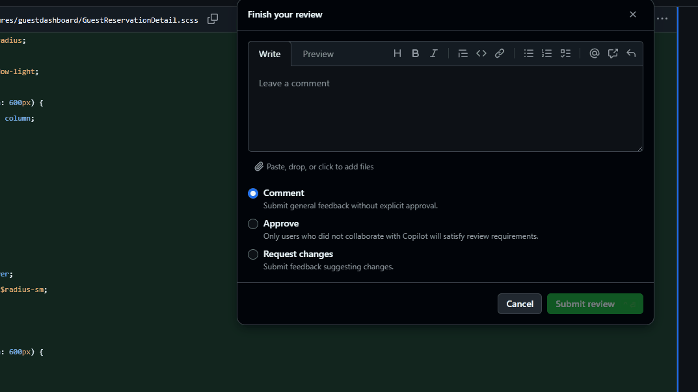
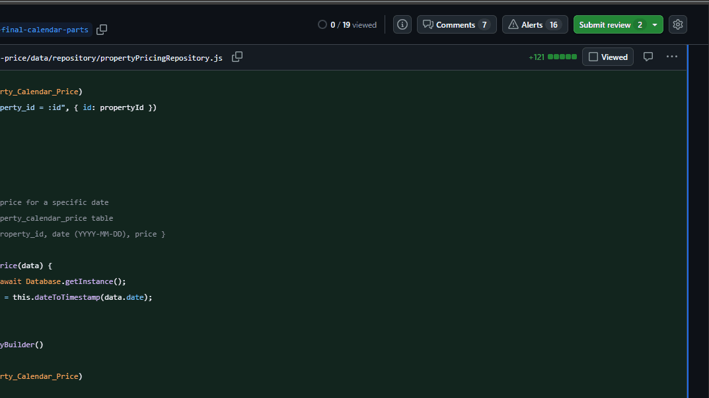

# PR Reviewer Onboarding Doc

## As PR Reviewer

Make sure that the PR follows every check in the checklist. More info to come soon as PR reviewer.

## As PR Requester

Reviewing a PR can be really confusing at sometimes. This documentation will explain you how to review a PR.
Additionaly, check out those links to extend your knowledge about PR reviewing:

1. The pull requester sends you a PR, where you can access the PR.  

2. Check the PR template, read the name, description at Proposed Changes.

> [!Note]
> Ensure that the PR you review is ideally under 500 lines, and defintely under a 1000 lines.  
> You can verify this by checking the total size of the PR in the upper right corner.

3. After understanding what the PR is about, scroll all the way up to see a button where you can press **Add your review**. This will redirect you to the Files changed tab. If this button is not visible, access the files changed tab manually.

> [!TIP]
> For a better experience reviewing a PR, click the Try the new experience while reviewing your PR. This doc is made using the new experience, so please keep that in mind.  
> 

4. Review the code.  
* Ensure code follows checklist (no console.logs/ global styling, inline styling)
* Ensure code has no unnecessary comments
* Ensure code follows the Domits [Code Conventions](https://github.com/domits1/Domits/blob/acceptance/docs/internal/standards/code_conventions.md) and use the [Clean Code: Reference Guide](https://github.com/domits1/Domits/blob/acceptance/docs/internal/standards/clean_code_reference_guide.md) to your advantage and pinpoint things which don't seem right
* Use common sense. If you see something where you think "Hm, that doesn't seem right", research a bit on the code, to validate your claim about something not being right, and then add a comment about it.

Afterwards, you can decide if the comments you place are good to be pushed through production, or need some fine tuning.

Hereby some visual explanations showing the how's on doing your reviewing part:

**Making a comment on a line or multiple and adding suggestions:**

**Approving a Pull Request**

**Requesting changes on a Pull Request**

**After that, you should always, but ALWAYS ensure all CI checks pass.**  
Those are vital, if a CI fails, that means that the PR broke something. To get a detailed guide on what, click the test what failed.  

Last but not least, ensure the branch is up-to-date with acceptance. Go to the github repo -> code -> branches or click this fancy [link](https://github.com/domits1/Domits/branches)  
  
It's a good idea that you make sure your PR is never behind, by running `git pull origin acceptance`

Here are some additional resources you can take a look to, to get a better grasp of reviewing a pull request.

- [links with good indicators for code reviewing](https://docs.aws.amazon.com/wellarchitected/latest/devops-guidance/indicators-for-code-review.html)
- [making a good PR](https://docs.aws.amazon.com/wellarchitected/latest/devops-guidance/dl.cr.6-initiate-code-reviews-using-pull-requests.html)
- [pits to look out for](https://docs.aws.amazon.com/wellarchitected/latest/devops-guidance/anti-patterns-for-code-review.html)