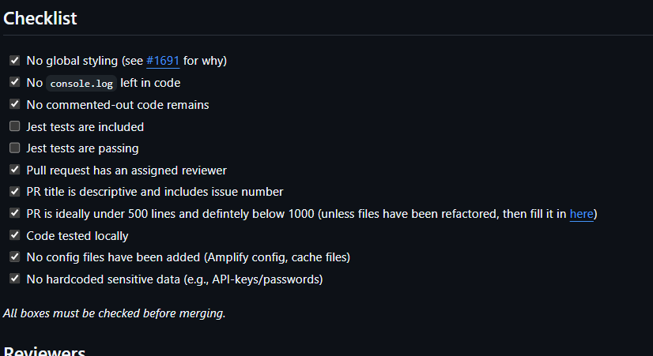

# PR Reviewer Onboarding Doc

## As PR Reviewer

Make sure that the PR you're about to
## As PR Requester

Reviewing a PR can be really confusing at sometimes. This documentation will explain you how to review a PR.
Additionaly, check out those links to extend your knowledge about PR reviewing:

1. The pull requester sends you a PR, where you can access the PR.

2. Check the PR template, read the name, description at Proposed Changes.

> [!Note]
> Ensure that the PR you review is ideally under 500 lines, and defintely under a 1000 lines.  
> You can verify this by checking the total size of the PR in the upper right corner.

3. After understanding what the PR is about, scroll all the way up to see a button where you can press **Add your review**. This will redirect you to the Files changed tab. If this button is not visible, access the files changed tab manually.

> [!TIP]
> For a better experience reviewing a PR, click the Try the new experience while reviewing your PR. This doc is made using the new experience, so please keep that in mind.  
> 

4. Review the code.  
I'm reviewing markdown code. This can be different, but I will tell you things you can check the code for.  
First, check the Checklist, and see if this PR follows the checklist.    Once you verified that the checklist has been checked correctly, you can proceed to the following things:  
* A
* B
* C  

- [links with good indicators for code reviewing](https://docs.aws.amazon.com/wellarchitected/latest/devops-guidance/indicators-for-code-review.html)
- [making a good PR](https://docs.aws.amazon.com/wellarchitected/latest/devops-guidance/dl.cr.6-initiate-code-reviews-using-pull-requests.html)
- [pits to look out for](https://docs.aws.amazon.com/wellarchitected/latest/devops-guidance/anti-patterns-for-code-review.html)