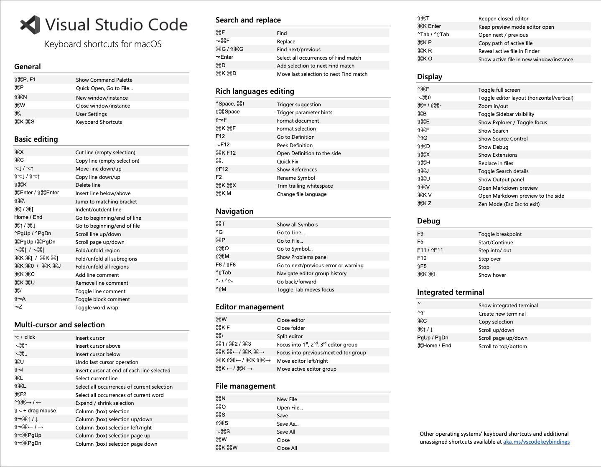

NOTE: This doc gets updated frequently in GitHub Docs, so this MIGHT be outdated. Refer to [the wiki.](https://github.com/domits1/Domits/wiki/Programming)


Resources
* Visual onboarding [software design architecture](https://roadmap.sh/software-design-architecture), [system design](https://roadmap.sh/system-design)
* [frontend](https://roadmap.sh/frontend), [backend](https://roadmap.sh/backend), [fullstack](https://roadmap.sh/full-stack), [engineering manager](https://roadmap.sh/engineering-manager)
* [Javascript](https://roadmap.sh/javascript), [React](https://roadmap.sh/react), [Node.js](https://roadmap.sh/nodejs), [React Native](https://roadmap.sh/react-native), [AWS](https://roadmap.sh/aws)
* [Visual role-based and skill-based roadmaps for onboarding engineers](https://roadmap.sh/roadmaps)
* [Git and Github](https://roadmap.sh/git-github)
* [Code conventions](https://github.com/domits1/Domits/wiki/Code-conventions)
* [Documentation standards](https://github.com/domits1/Domits/wiki/Documentation-standards)
* [SASS / SCSS Guide](https://github.com/domits1/Domits/wiki/SASS---SCSS-Standard) 

# Levels to complete

## level 1
### Technical Skills (links to proof skills)
* [ ] JavaScript fundamentals (ES6+): let/const, arrow functions, promises, async/await 
* [ ] HTML/CSS: Flexbox, Grid, responsive design, basic accessibility 
* [ ] Git basics: (link to proof skills of clone, commit, push, pull, branches, merge conflicts)
* [ ] Basic debugging in browser dev tools 
* [ ] Frontend framework basics: React (hooks, JSX, components, props/state)
* [ ] Basic Node.js: Express, REST APIs, async/await
* [ ] Basic SQL and/or NoSQL

### Cloud/AWS (links to proof AWS skills)
* [ ] Understand what AWS is
* [ ] Basics of EC2, S3
* [ ] Use AWS CLI to interact with services

### Mindset / Soft Skills (Show photo with books)
* [ ] Learn how to ask good questions
* [ ] Learn how to Search/debug
* [ ] Communicate clearly in standups and PRs
* [ ] Be reliable with small tasks
* [ ] Read books (e.g., Clean Code, The Pragmatic Programmer)

## Short cuts of Visual studio Code IDE 
### Windows


### MAC



## level 2
### Technical Skills (links to proof skills)
* [ ] Solid React skills: useEffect, custom hooks, context API
* [ ] TypeScript basics
* [ ] Test writing: unit tests (Jest) and integration tests
* [ ] REST and/or GraphQL proficiency
* [ ] Authentication flows (JWT, OAuth, session)
* [ ] Create fullstack apps (Node.js backend + React frontend)
* [ ] Understand performance basics: lazy loading, debouncing, etc.

### AWS / DevOps (links to proof AWS skills)
* [ ] Use AWS services like Lambda, API Gateway, RDS / Aurora DSQL (PostgreSQL) / DynamoDB
* [ ] Understand IAM roles and permissions
* [ ] Write infrastructure as code with CloudFormation or Terraform
* [ ] CI/CD basics (GitHub Actions, CodePipeline)

### Professional Skills (links to proof skills)
* [ ] Participate in code reviews
* [ ] Break down features into tasks
* [ ] Estimate work time effectively
* [ ] Start mentoring interns/juniors
* [ ] Contribute to team discussions

## level 3
### Technical Skills (links to proof skills)
* [ ] Expert in JavaScript/TypeScript
* [ ] Design scalable architecture (e.g. microservices, serverless)
* [ ] Deep understanding of React internals and performance
* [ ] Lead complex refactors and tech debt initiatives
* [ ] Set up advanced testing strategies (mocking, coverage reports)
* [ ] Review system design with trade-offs

### AWS / DevOps (links to proof AWS skills)
* [ ] Design end-to-end systems using AWS services (S3, Lambda, RDS, Aurora DSQL (PostgreSQL), DynamoDB, API Gateway, SNS/SQS, CloudWatch)
* [ ] Create secure, cost-efficient, and scalable cloud architectures
* [ ] Monitor and optimize production workloads (CloudWatch, X-Ray, etc.)
* [ ] Mentor others on cloud usage and DevOps practices

### Leadership & Impact (links to proof skills)
* [ ] Lead projects from design to deployment
* [ ] Own components/services
* [ ] Influence architectural decisions
* [ ] Mentor other engineers
* [ ] Set coding standards and best practices
* [ ] Communicate with non-technical stakeholders

Other resources:
Laws of engineering
1. Make it work
2. If you really need to, make it beautiful
3. If you really really need to, make it fast

Tech Stack
1. Frontend: [React](https://reactjs.org/), [React Native](https://reactnative.dev/)
2. Backend: [Node.js](https://nodejs.org/en/), Python
3. Client platforms: iOS, Android, Web (Desktop-Mobile)
4. Technologies: IoT
5. Datastores: [Aurora DSQL (PostgreSQL)](https://github.com/domits1/Domits/wiki/Database-schema-design)
6. Error monitoring: AWS Cloudwatch
7. [AWS Infrastructure - Cloud](https://github.com/domits1/Domits/wiki/AWS-Business-Logic)
8. Version control: Git (Github)
9. Tools: Discord, Slack, Asana, Stripe, 
10. APIs: RESTful, HTTP, Websocket 

Engineering Departments
* Infrastructure department
* Development department
* UX department
* Security department
* Quality department
* Customer support department
* Incubation engineering department

Information Security and Best Practices
* General idea: Handle company data as if it was your financial information. You shouldn't share it with everyone and, if you share it, you should know why they need it and what they will do with it. 

# Clean Code: Quick Reference Guide

## Introduction

This guide summarizes key principles from "Clean Code" by Robert C. Martin to help our team write maintainable, readable, and efficient code. These practices will help you contribute effectively to our codebase and develop good habits for your future career.

## Why Clean Code Matters

- Code is read more often than it is written
- Poor code slows down development and increases technical debt
- Clean code enables faster onboarding, easier maintenance, and fewer bugs
- Your code represents your professionalism and care for the craft

## Fundamental Principles

### 1. Meaningful Names

- Choose descriptive and unambiguous names
- Names should reveal intent
- Class names should be nouns (e.g., `Customer`, `Account`)
- Method names should be verbs (e.g., `saveAccount()`, `deleteItem()`)
- Avoid misleading names or abbreviations

**Example:**
```java
// Poor naming
int d; // elapsed time in days
public List<int[]> getThem() {...}

// Better naming
int elapsedTimeInDays;
public List<Cell> getFlaggedCells() {...}
```

### 2. Functions

- Functions should be small (ideally < 20 lines)
- Functions should do one thing
- Function names should describe what they do
- Minimize the number of arguments (0-2 is ideal)
- Avoid flag arguments (boolean parameters)
- Don't use output arguments

**Example:**
```java
// Not clean: does multiple things, has flag parameter
public void emailClients(List<Client> clients, boolean monthlyReport) {
    for(Client client : clients) {
        if(monthlyReport) {
            // Send monthly report email
        } else {
            // Send different email
        }
    }
}

// Clean: separated responsibilities, clear intent
public void sendMonthlyReportToClients(List<Client> clients) {
    for(Client client : clients) {
        sendMonthlyReport(client);
    }
}

public void sendWeeklyReportToClients(List<Client> clients) {
    for(Client client : clients) {
        sendWeeklyReport(client);
    }
}
```

### 3. Comments

- Good code is self-explanatory - minimal comments needed
- Comments should explain "why" not "what" or "how"
- Avoid redundant or misleading comments
- Update comments when code changes
- Use comments for legal information, warnings, or TODO items

**Example:**
```java
// Bad: Comment explains what the code does (which is obvious)
// Loop through each item in the list
for(Item item : items) {...}

// Good: Comment explains why a non-obvious approach was taken
// Using binary search here instead of hash lookup 
// because the dataset is always sorted and memory is constrained
```

### 4. Formatting

- Be consistent with formatting rules
- Related code should appear together
- Use blank lines to separate concepts
- Keep files and classes small
- Indentation should reflect structure

### 5. Error Handling

- Use exceptions rather than return codes
- Create informative error messages
- Don't return or pass null
- Define exception classes according to caller's needs

**Example:**
```java
// Poor error handling
public void processFile() {
    try {
        // File processing code
    } catch(Exception e) {
        System.out.println("Error"); // Uninformative
    }
}

// Better error handling
public void processFile() throws FileProcessingException {
    try {
        // File processing code
    } catch(IOException e) {
        throw new FileProcessingException("Could not process file: " + e.getMessage(), e);
    }
}
```

### 6. Classes

- Classes should be small and have a single responsibility
- Class name should describe its responsibility
- High cohesion: methods and variables should be closely related
- Encapsulate implementation details
- Prefer composition over inheritance

### 7. Unit Tests

- Tests should be clean, readable, and maintainable
- Follow the FIRST principles:
  - **F**ast: Tests should run quickly
  - **I**ndependent: Tests shouldn't depend on each other
  - **R**epeatable: Tests should be reliable in any environment
  - **S**elf-validating: Tests should have a boolean output
  - **T**imely: Tests should be written just before the production code
- One assert per test function
- Test one concept per test function

### 8. Code Smells

Watch out for these common issues:
- Duplicated code
- Long methods or classes
- Large number of parameters
- Divergent changes (one class changed for multiple reasons)
- Feature envy (method more interested in another class than its own)
- Inappropriate intimacy (classes that know too much about each other)

## Practical Tips for Our Team

1. **Review before committing**: Check your own code for these principles before requesting review
2. **Refactoring time**: Dedicate some time each sprint to refactoring
3. **Boy Scout Rule**: Leave the code cleaner than you found it
4. **Pair programming**: Work together to apply these principles
5. **Code reviews**: Use these principles as a checklist during reviews

## Conclusion

Clean code isn't about perfectionism—it's about professionalism and practicality. By following these principles, you'll write code that's easier to understand, maintain, and extend. Remember that clean code is a journey, not a destination.

## Resources

- Martin, R.C. (2008). Clean Code: A Handbook of Agile Software Craftsmanship
- The team's style guide (see repository) 