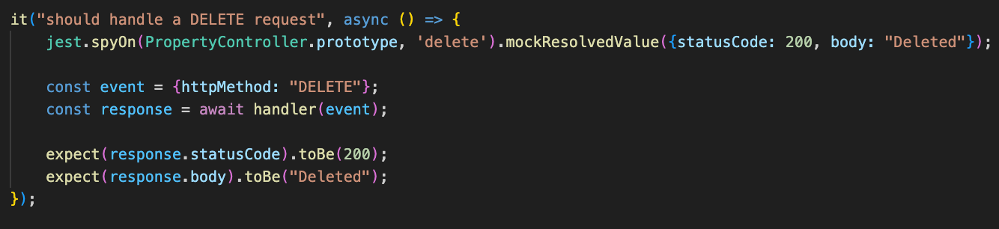

# Testing Guidelines Doc

## Why do we do testing?

We write tests to make sure our code works as expected.
Testing helps us find bugs early, before the code is released. It saves time by preventing issues in production.
Tests give us confidence when changing or refactoring code.
They also show how a function or feature is supposed to work. Testing makes code easier to maintain.
It helps teams work together more safely. Overall, testing improves code quality and reliability.

## Why is testing not always necessary?

Not all code needs to be tested.
Very simple code may not need its own tests. For example,basic data fetching or simple getters. Some code is already covered by other tests. We should focus on testing important logic.

## What is a good test?

A good test focuses on one responsibility and verifies a clear expected outcome.
It isolates external dependencies and is easy to read and understand.

**Example of a good test (routing unit test)**

The following test verifies that a DELETE request is routed correctly.
The controller is mocked so the test stays isolated and fast.

**Why this is a good test:** 
It tests one thing (routing) 
It mocks external dependencies 
It has clear assertions 
It is easy to understand 

## What is a bad test?

A bad test is unclear, tests too many things at once, or does not verify results.
Such tests may pass even when the code is broken.

**Why this is a bad test:** 
No assertions 
Unclear purpose 
Test can pass even if the code is wrong 
