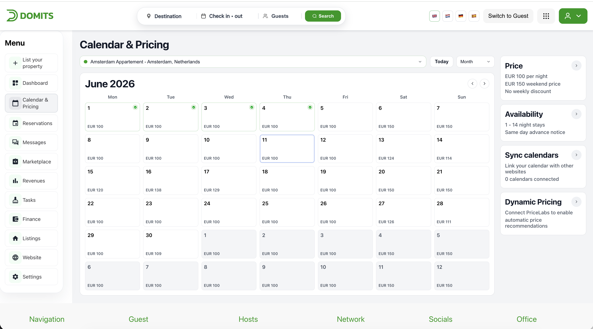
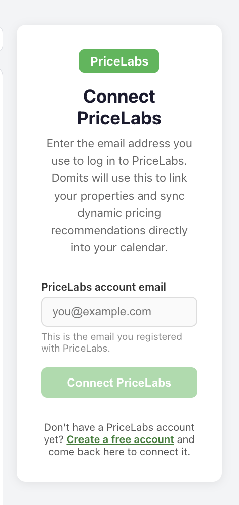
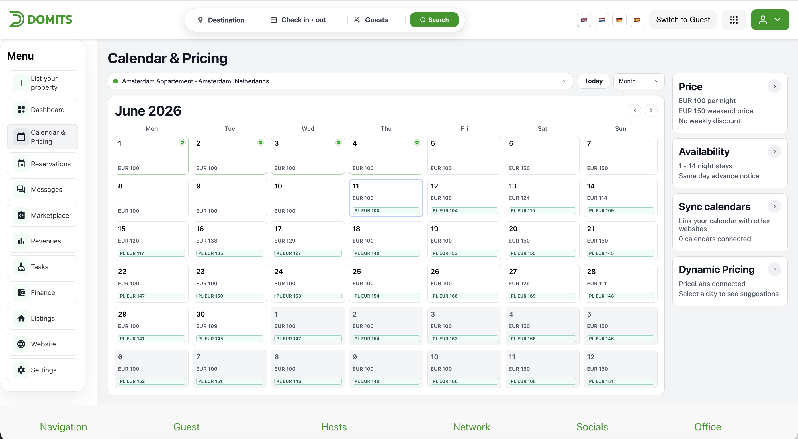
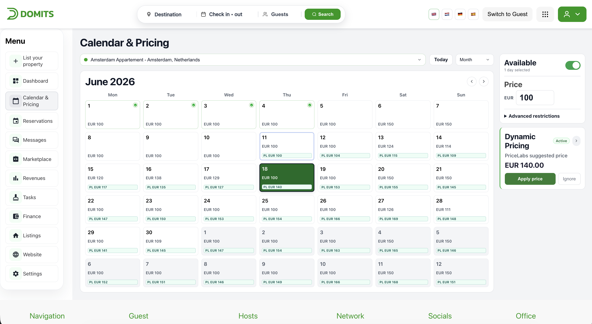
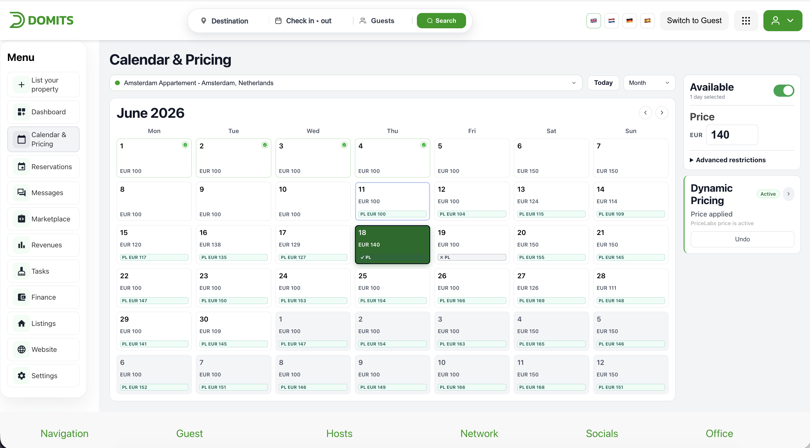
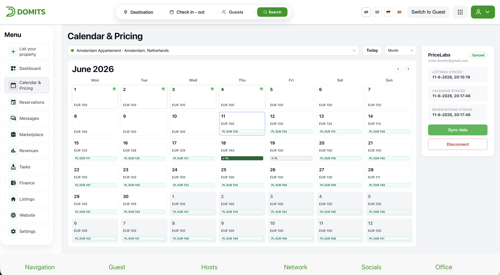

# Dynamic Pricing with PriceLabs — Host Guide

Domits integrates with [PriceLabs](https://www.pricelabs.co), a dynamic pricing platform that analyses market demand and suggests an optimal nightly price for every date on your calendar. You stay in control: suggestions are never applied automatically — you decide per date whether to apply or ignore them.

---

## Before you start

You need a PriceLabs account. If you don't have one yet, create a free account at [hello.pricelabs.co/signup](https://hello.pricelabs.co/signup/), the connect form in Domits also links to this page.

---

## 1. Connecting PriceLabs

1. Log in to Domits and go to **Host Dashboard → Calendar & Pricing**.
2. In the sidebar on the right, click the **Dynamic Pricing** card.

   

3. Enter the **email address of your PriceLabs account** and click **Connect PriceLabs**.

   

4. Domits automatically links all your properties and sends your listings, calendar and reservations to PriceLabs. This may take a few seconds.

After connecting, the Dynamic Pricing card shows an **Active** badge and PriceLabs starts generating price suggestions (usually within a day).

---

## 2. Viewing price suggestions

Open **Calendar & Pricing**. Dates with a PriceLabs suggestion show a badge on the calendar tile:

| Badge | Meaning |
|-------|---------|
| `PL €104` (teal) | PriceLabs suggests this price — awaiting your decision |
| `✓ PL` (green) | You applied the PriceLabs price; it is now your nightly rate |
| `✗ PL` (grey) | You ignored the suggestion; your own price stays active |

### Restriction indicators

Besides prices, PriceLabs also recommends booking restrictions. These appear as small labels on the calendar tiles:

| Label | Meaning | Set by |
|-------|---------|--------|
| `Min 2` | Minimum stay: bookings including this date must be at least 2 nights (the price shown is still per night) | PriceLabs sync or host |
| `No CI` | Guests cannot check in on this date | PriceLabs sync or host |
| `No CO` | Guests cannot check out on this date | PriceLabs sync or host |
| `Max 7` | Maximum stay of 7 nights | Host only |
| `Stop` | Date is closed for selling | Host only |

PriceLabs sends a minimum stay recommendation for most dates, so the `Min` label is common after a sync. A minimum stay of 1 night is the default and is not shown. Maximum stay and stop-sell are never changed by PriceLabs — those only appear when you set them yourself in the restrictions form.

---

## 3. Applying or ignoring a suggestion

1. Click a date (or select a range of dates) on the calendar.
2. The **Dynamic Pricing** card in the sidebar shows the suggested price with two buttons:
   - **Apply price** — the PriceLabs price becomes your nightly rate for the selected date(s).
   - **Ignore** — the suggestion is dismissed; your own price stays active.

   

Your decision is saved immediately and stays in place after a refresh or when you log in again.

---

## 4. Changing your mind (Undo)

Selected a date you already decided on? The sidebar shows **"Price applied"** or **"Suggestion ignored"** with an **Undo** button. Clicking Undo restores the original suggestion so you can choose again. Undoing an applied price reverts that date to your own base price.

---

## 5. Syncing manually

Domits and PriceLabs sync automatically (PriceLabs pushes new prices daily, and Domits notifies PriceLabs whenever your listings, calendar or reservations change). To force a refresh:

- In **Domits**: open the Dynamic Pricing card and click **Sync data** (sends your latest data to PriceLabs).
- In **PriceLabs**: open your listing and click **Sync Now** (sends the latest prices to Domits).

---

## 6. Disconnecting

Open the Dynamic Pricing card and click **Disconnect**. A loading state is shown until the disconnect completes.

What happens to your prices:

- Open suggestions are removed from your calendar.
- Dates where you applied a PriceLabs price revert to your own base price.
- Dates where you set your own price keep that price.

You can reconnect at any time; PriceLabs will start sending fresh suggestions again.

---

## Frequently asked questions

**I connected but don't see any suggestions.**
PriceLabs needs your calendar data before it can generate prices, and pushes suggestions on a daily cycle. Click **Sync data** in Domits, then **Sync Now** in PriceLabs. Suggestions appear after the next sync.

**Why does a date show "Price applied" when I set that price myself?**
Domits detects an applied suggestion by comparing your nightly price with the PriceLabs suggestion. If you manually set a price identical to the suggestion, it is shown as applied — the effect on your calendar is the same.

**Does PriceLabs ever change my prices without asking?**
No. Suggestions are stored separately from your prices and only become active when you click Apply.
